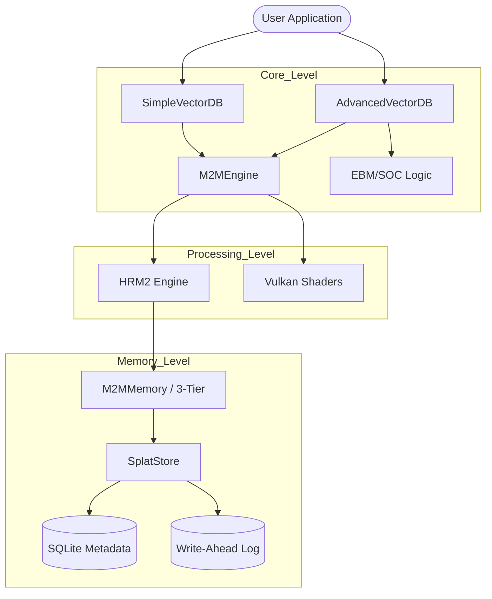

# M2M EBM Vector Database Documentation

Welcome to the comprehensive documentation of the **M2M (Machine-to-Memory) EBM Vector Database**. This document provides a detailed breakdown of the system architecture, file-by-file explanations, and the technical principles that power our "living" latent memory system.

---

## 🏗️ System Architecture & Hierarchy

The M2M database operates through a strictly decoupled 4-layer hierarchy. This separation of concerns ensures that high-level API logic remains independent of low-level GPU acceleration or mathematical modeling.

### 1. API Layer (`SimpleVectorDB` / `AdvancedVectorDB`)
**Location:** `src/m2m/__init__.py`
The entry point for all users. It manages the public contract, input validation, and high-level routing.
- **SimpleVectorDB**: Optimized for edge deployment and standard RAG workflows.
- **AdvancedVectorDB**: Includes cognitive features such as EBM energy querying and SOC rebalancing.

### 2. Orchestration Layer (`M2MEngine`)
**Location:** `src/m2m/engine.py` & `src/m2m/hrm2_engine.py`
The "commander" of the system. It coordinates the lifecycle of memory and bridges the gap between Python logic and hardware-accelerated search (Vulkan).
- **M2MEngine**: General-purpose orchestration.
- **HRM2Engine**: Specialized engine for Hierarchical Retrieval Model 2, managing two-level clusters.

### 3. Memory Management Layer (`M2MMemory`)
**Location:** `src/m2m/memory.py`
The cognitive management system. It implements the **3-Tier Memory Hierarchy**:
- **Hot (VRAM)**: Extreme-speed retrieval for active context.
- **Warm (RAM)**: High-speed access for the current dataset.
- **Cold (SSD)**: Persistent storage for long-term historical data.

### 4. Data Structure Layer (`SplatStore`)
**Location:** `src/m2m/splats.py`
The mathematical foundation. Vectors are stored as **Gaussian Splats** (µ, α, κ), allowing the database to represent not just points, but probabilistic "densities" of knowledge in the latent space.

---

## 📂 Source Code Breakdown (`src/m2m/`)

Each file in the core directory plays a specific role in the system's operation.

### Core Components
| File | Functionality |
| :--- | :--- |
| `__init__.py` | Main library interface. Exports `SimpleVectorDB`, `AdvancedVectorDB`, and geometry utilities. |
| `engine.py` | Implementation of `M2MEngine`. Handles high-level vector ops and Vulkan logic. |
| `hrm2_engine.py` | The logic for **HRM² (Hierarchical Retrieval Model 2)**. Manages coarse and fine clusters. |
| `memory.py` | Manages the life-cycle of memories, including consolidation and 3-tier movement. |
| `splats.py` | The base `SplatStore` class. Handles serialization and memory mapping of Gaussian Splats. |
| `splat_types.py` | Typed definitions for Gaussian Splats, ensuring structured storage. |
| `config.py` | Centralized configuration management (latent dimensions, SOC thresholds, hardware selection). |

### Mathematics & Indexing
| File | Functionality |
| :--- | :--- |
| `clustering.py` | High-performance K-Means implementation tailored for latent space organization. |
| `geometry.py` | Spherical geometry utilities (Log/Exp maps, geodesic distances) for the S^n manifold. |
| `encoding.py` | Transforms raw data (positions, colors, etc.) into the M2M latent embedding format. |
| `lsh_index.py` | **Locality-Sensitive Hashing** fallback for uniform data distributions where clustering is inefficient. |
| `energy.py` | Defines the energy functions (E_splats, E_geom, E_comp) used in the EBM landscape. |

### EBM & Cognitive Systems (`src/m2m/ebm/`)
| File | Functionality |
| :--- | :--- |
| `energy_api.py` | Interface for querying the database using energy potentials (gradients, free energy). |
| `exploration.py` | Novelty-seeking algorithms. Suggests regions of the latent space with high uncertainty ("knowledge gaps"). |
| `soc.py` | **Self-Organized Criticality**. Automatically triggers "avalanches" to rebalance the memory density. |

### Graph & Entity Systems
| File | Functionality |
| :--- | :--- |
| `entity_extractor.py` | NLP-driven extraction of entities from raw text to be stored as splats. |
| `graph_splat.py` | Knowledge Graph store that treats nodes as splats and edges as energy bridges. |

### Infrastructure
| File | Functionality |
| :--- | :--- |
| `api/edge_api.py` | A lightweight FastAPI implementation for the REST interface. |
| `cluster/` | Logic for distributed M2M nodes and energy-aware routing. |
| `storage/` | Persistence layer. Contains the **Write-Ahead Log (WAL)** and SQLite metadata maps. |
| `data_lake.py` | High-throughput data ingestion and dataset transformation logic. |
| `dataset_transformer.py` | Utility to re-center or transform datasets to better fit the HRM² hierarchical structure. |
| `shaders/` | GLSL compute shaders for Vulkan-based GPU acceleration. |

---

## 🚀 Technical Deep Dive

### Energy-Based Model (EBM)
M2M treats the latent space as a physical system. Every piece of information has an associated **Energy Level**. 
- **Low Energy**: Stable, well-understood information.
- **High Energy**: Novel, uncertain, or conflicting information.
By querying gradients of the energy field, M2M can identify where it needs to "learn more" or where its knowledge is most concentrated.

### Self-Organized Criticality (SOC)
M2M uses **Avalanche Dynamics** to prevent memory saturation. If a specific region of the latent space becomes too "energetic" (over-saturated with vectors), the SOC engine triggers a local redistribution of weights, similar to a sandpile reaching its critical state. This ensures the database self-balances without manual tuning.

### Hierarchical Retrieval (HRM²)
Traditional indexing (like HNSW) can be slow to build. HRM² uses a two-level clustering strategy:
1. **Coarse Clusters**: Rapidly narrow down the search to a general semantic region.
2. **Fine Experts**: Perform exact or approximated scoring within that region.
This allows for sub-millisecond search across millions of splats on standard CPU hardware.

---

## 🔗 Connection Graph

---

*M2M Documentation v2.0 — Machine-to-Memory, Energy-to-Intelligence*
