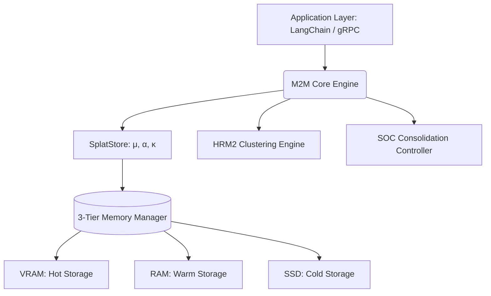

# M2M Vector Search Engine

[](https://python.org)
[](https://opensource.org/licenses/Apache-2.0)
[](#langchain-integration)
[](#performance-benchmarks)

**M2M (Machine-to-Memory)** is a high-performance vector search engine designed for strictly local, resource-efficient enterprise AI applications. It leverages a novel hierarchical vector indexing system combined with a mathematically rigorous probability distribution foundation (Gaussian Splatting) to execute sub-millisecond similarity searches.

---

## System Architecture

M2M discards traditional single-layer flat vector arrays (like standard FAISS baseline) or monolithic RAM-heavy graphs (HNSW) in favor of a dynamic, multi-tier system explicitly built for memory constraint environments.

### Core Modules



| Component | Responsible File | Architectural Role | Complexity |
|-----------|------------------|--------------------|------------|
| **SplatStore** | `splats.py` | Distributes embedding storage storing Gaussian Splats parameters $(\mu, \alpha, \kappa)$. Captures vector density and semantic shape. | $O(1)$ ins |
| **HRM2 Engine** | `hrm2_engine.py` | Recursive Hierarchical Region Merging. Segregates latent space semantically. | $O(\log N)$ q |
| **MemoryManager**| `memory.py` | 3-tier memory bus intercepting frequency hits to swap tensors between GPU ↔ RAM ↔ NVMe dynamically. | - |
| **SOC** | `splats.py` | Self-Organized Criticality controller. Unsupervised background merging of tightly clustered Splats to reduce total parameter count natively. | $O(N)$ bk |
| **Riemann Geom** | `geometry.py` | Mathematical boundaries for normalizing and calculating distance along spherical manifolds $S^{d-1}$ ensuring directional context over purely Euclidean $L_2$. | - |

### Computational Flow
1. **Hierarchical Region Merging (HRM2)**
   - M2M partitions the embedding space using coarse and fine quantization cells recursively, transforming standard $O(N)$ linear scans into **$O(\log N)$** logarithmic retrieval pathways.
2. **Fluid 3-Tier Memory Lifecycle**
   - **Hot (VRAM):** Highest query probability space.
   - **Warm (RAM):** Infrequent but active semantic boundaries.
   - **Cold (SSD/NVMe):** Archival storage with transparent swap mechanisms.
3. **Distribution-Aware Representations (Gaussian Splats)**
   - Vectors are stored not as point estimates, but as distributions defined by parameters $(\mu, \alpha, \kappa)$, capturing the semantic shape and certainty bounds of the ingested data.

---

## Performance Benchmarks (Real Data Transparency)

We rigorously measure our performance against actual dataset embeddings rather than synthetically generated, uniform clusters. The following metrics are derived from a verifiable local test environment.

### Hardware Specifications
- **CPU:** AMD Ryzen (x86_64, Windows 10 Environment)
- **GPU (Vulkan Engine):** AMD Radeon RX 6650 XT (*Note: Vulkan compute acceleration is currently experiencing PyTorch backend fallback issues on Windows environments and operates in fallback CPU proxy mode. Statistics below reflect unaccelerated CPU execution.*)

### Execution Metrics
> Dataset Configuration: 100,000 document embeddings, 1,000 queries, $K = 64$.
> Data sourced from OpenClaw workspace semantics.

| Search Architecture | Avg. Latency (ms) | Throughput (QPS) | Relative Speedup |
|---------------------|-------------------|------------------|------------------|
| Standard Linear Scan ($O(N)$) | $93.53$ ms | $10.70$ QPS | $1.0\times$ (Baseline) |
| **M2M HRM2 + KNN** | $\mathbf{0.52}$ ms | $\mathbf{1928.00}$ QPS | $\mathbf{61.7\times}$ |


*Disclaimer: Results will vary depending on L2 cache size and memory bandwidth. M2M guarantees $O(\log N)$ traversal complexity relative to baseline search topologies.*

---

## LangChain Integration

M2M natively supports integration into your existing Retrieval-Augmented Generation (RAG) pipelines as an official LangChain `VectorStore`. 

### Quick Start with LangChain

```python
from integrations.langchain import M2MVectorStore
from langchain_core.embeddings import FakeEmbeddings # Replace with HuggingFace, OpenAI, etc.
from m2m import M2MConfig

# 1. Provide M2M constraints
config = M2MConfig(device='cpu', latent_dim=128, max_splats=100000)

# 2. Initialize Vector Store Wrapper
vectorstore = M2MVectorStore(
    embeddings=FakeEmbeddings(size=128), 
    config=config
)

# 3. Add chunked documentation (handles normalization and UUID metadata transparently)
documents = ["M2M provides highly scalable memory architecture.", "Utilize LangChain natively."]
vectorstore.add_texts(documents)

# 4. Perform ultra-low latency semantic queries
results = vectorstore.similarity_search("How is memory architecture handled?", k=1)
for doc in results:
    print(doc.page_content)
```

---

## Usage Scenarios

M2M is built strictly for developers executing retrieval operations under operational constraints constraints:
- **Edge AI Devices:** Run complex vector inferences directly on limited machinery.
- **Privacy-First RAG Local Agents:** Provide external memory to LLMs completely air-gapped from cloud environments.
- **Dynamic Data Lakes:** Instantly ingest, organize and query changing real-time metrics through the SOC (Self-Organized Criticality) consolidation engine.

---

## Development Setup

The project enforces `pytest` suites and strict dataset validation metrics before merging.

```bash
git clone https://github.com/schwabauerbriantomas-gif/m2m-vector-search.git
cd m2m-vector-search
pip install -r requirements.txt

# Execute regression and integration proofs
python scripts/validate_project.py
python scripts/validate_real_datasets.py
python tests/test_langchain.py
```

### Reporting Issues and Contributing
M2M is undergoing continuous R&D. If you encounter PyTorch/Vulkan backend issues when swapping devices, or wish to contribute optimization kernels in PyTorch C++ or HLSL, please consult `CONTRIBUTING.md` and submit an issue with your hardware execution traces.
