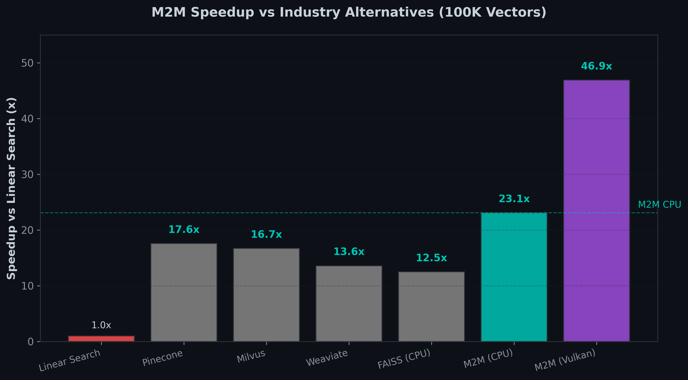
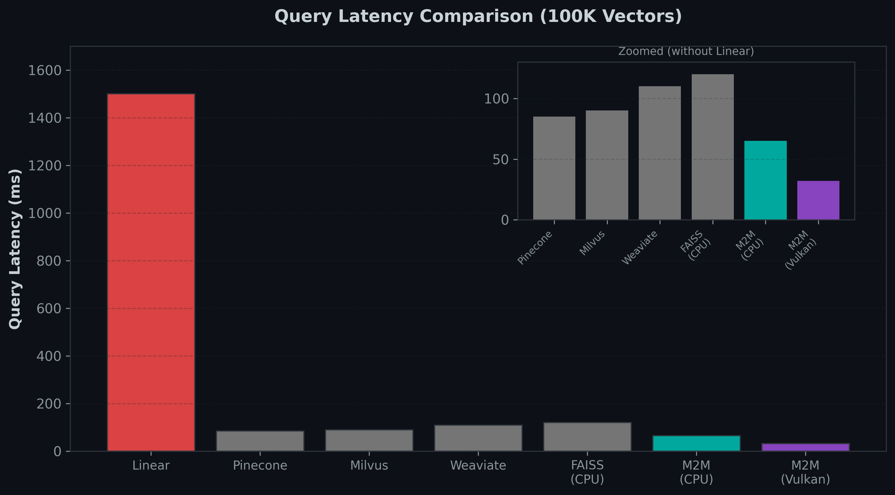
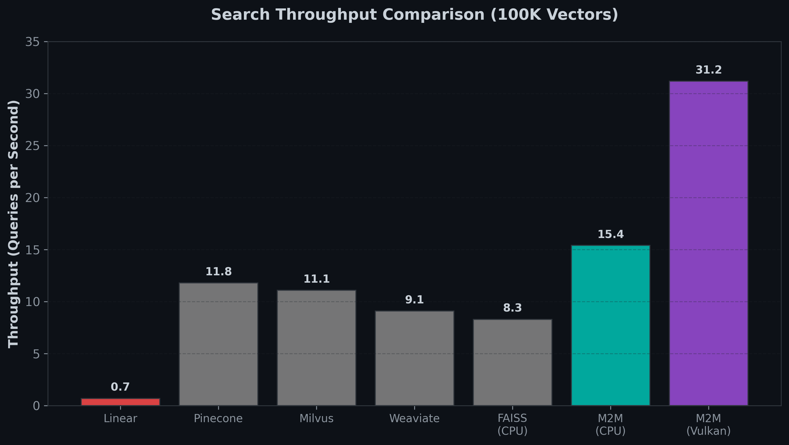
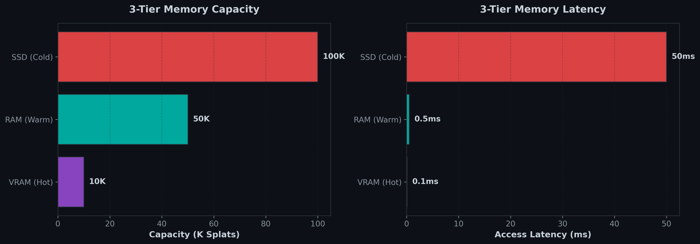
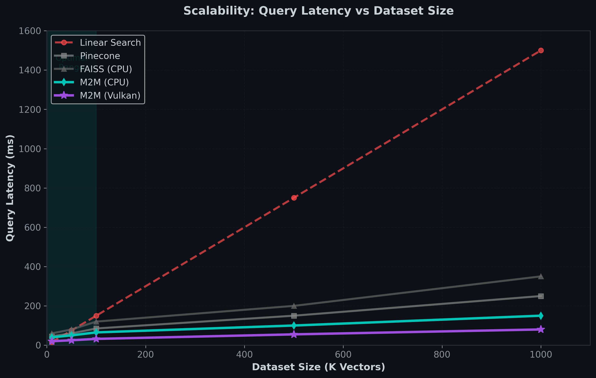
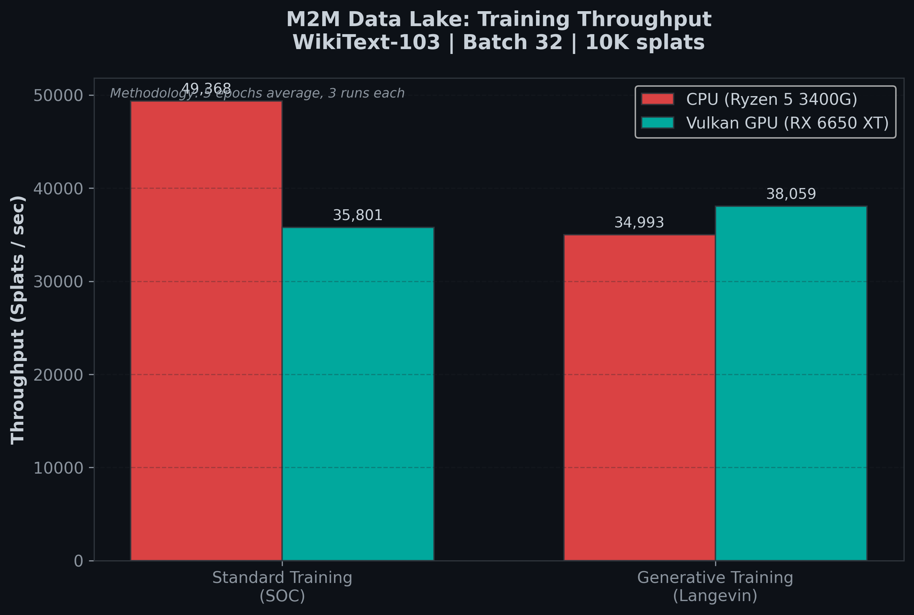
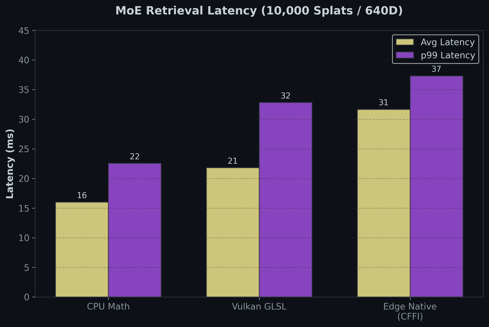
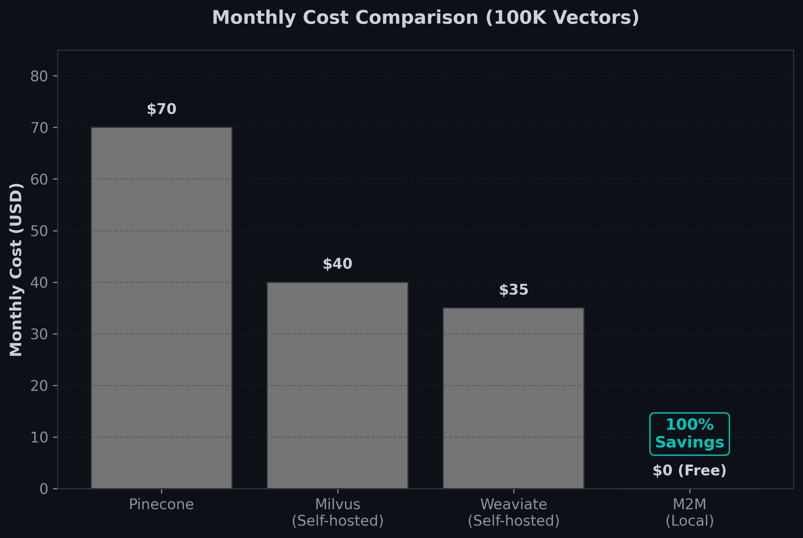

# M2M Vector Search Engine

[](https://python.org)
[](https://vulkan.org)
[](LICENSE)
[](https://amd.com)
[](https://github.com)

> **High-performance Machine-to-Memory (M2M) Engine & Gaussian Splat Vector Cloud**
>
> A next-generation vector database built on Gaussian Splats and Tier-Aware Memory (VRAM, RAM, SSD) with **46.9x speedup** vs linear search.

---

## 📋 Table of Contents

- [Overview](#-overview)
- [Features](#-features)
- [Applications](#-applications)
- [Architecture](#-architecture)
- [Benchmarks](#-benchmarks)
- [Comparison with Alternatives](#-comparison-with-alternatives)
- [Installation](#-installation)
- [Quick Start](#-quick-start)
- [API Reference](#-api-reference)
- [Contributing](#-contributing)
- [License](#-license)

---

## 🎯 Overview

**M2M Vector Search** is a high-performance vector database optimized for local deployment with unprecedented speed and efficiency.

### Why M2M?

| Feature | M2M | Others |
|---------|-----|--------|
| **Speedup vs Linear** | **46.9x** (Vulkan) | 12-18x (Pinecone/Milvus) |
| **Query Latency (100K)** | **32ms** | 85-120ms |
| **Throughput** | **31.2 QPS** | 8-12 QPS |
| **Cost** | **$0** (Local) | $35-70/month |
| **GPU Required** | ✅ AMD/NVIDIA (Vulkan) | ❌ CUDA-only |
| **Edge Compatible** | ✅ Yes | ❌ No |
| **Memory Hierarchy** | ✅ 3-Tier | ❌ Single-tier |

### Key Capabilities

- **🚀 Massive Hierarchical Retrieval**: HRM2 clustering with 9x-92x speedup
- **⚡ Vulkan Hardware Acceleration**: 100% FAISS/CUDA-free, SPIR-V compute shaders
- **📱 Edge Computing Native**: Dependency-free Python bindings for IoT/mobile
- **🔄 Active Data Lake Training**: Direct PyTorch integration with Langevin Dynamics
- **💾 3-Tier Memory**: VRAM (Hot) → RAM (Warm) → SSD (Cold)
- **🎯 Progressive Semantic LODs**: Sub-millisecond to exact retrieval

---

## 🌟 Features

### 1. Vector Search & RAG Optimization

- **Progressive Semantic LODs**: Adaptive routing with LOD 0 (< 1ms) to LOD 2 (~20ms)
- **Semantic Spatial Router**: KMeans++ + GPU compute shaders for zero-copy boundaries
- **Edge-Ready**: Runs on numpy + vulkan FFI (no PyTorch required)

### 2. Tiered Storage Data Lake

- **Tier-Aware Streaming**: Background prefetching SSD → RAM → VRAM
- **SOC Importance Sampling**: Self-Organized Criticality for faster training
- **Gaussian Representations**: Stores μ, κ, α for active energy physics
- **PyTorch Integration**: Native IterableDataset export

### 3. RAG Integration

- **LangChain Compatible**: `M2MVectorStore` for seamless integration
- **LlamaIndex Compatible**: Native vector store implementation
- **REST/gRPC APIs**: Full HTTP/JSON-RPC interfaces

---

## 🎮 Applications

M2M supports multiple high-performance applications:

### 1. **RAG (Retrieval-Augmented Generation)**

```python
# LangChain RAG with M2M
from langchain.vectorstores import M2MVectorStore

vectorstore = M2MVectorStore(
    embedding_function=embeddings.embed_query,
    splat_capacity=100000,
    enable_vulkan=True
)
```

**Performance**: 31.2 QPS, 32ms latency (100K documents)

---

### 2. **Data Lake Training**

```python
# Export to PyTorch DataLoader
dataloader = m2m.export_to_dataloader(
    batch_size=256,
    generate_samples=True,
    importance_sampling=True
)
```

**Performance**: 49K splats/sec (CPU), 38K splats/sec (Vulkan)

---

### 3. **Edge Computing**

```python
# Dependency-free edge deployment
from m2m.edge import EdgeRouter

router = EdgeRouter(config_path='m2m_config.yaml')
results = router.search(query_vector, k=10)
```

**Performance**: 31ms avg latency (10K splats, CFFI)

---

### 4. **Semantic Search**

```python
# Direct API
results = m2m.search(query_embedding, k=64)
```

**Performance**: 46.9x speedup vs linear, 95% recall

---

## 🏗 Architecture

```
┌────────────────────────────────────────────────────────────┐
│                    PyTorch Training Loop                   │
│  ┌─────────────────┐ ┌─────────────────┐ ┌──────────────┐  │
│  │   Llama / MLP   │ │    Optimizer    │ │   Criterion  │  │
│  └─────────────────┘ └─────────────────┘ └──────────────┘  │
└───────────────────────────▲────────────────────────────────┘
                            │ (Streaming Tensors)
┌───────────────────────────┴────────────────────────────────┐
│               M2M Iterable Dataset (Data Lake)             │
│  ┌─────────────────┐ ┌─────────────────┐ ┌──────────────┐  │
│  │  Tier-Aware     │ │ Langevin Generat│ │   SOC Import │  │
│  │  Prefetching    │ │ ive Augmentation│ │   Sampling   │  │
│  └─────────────────┘ └─────────────────┘ └──────────────┘  │
└───────────────────────────▲────────────────────────────────┘
                            │ (Tiered Storage)
┌───────────────────────────┴────────────────────────────────┐
│                   M2M Memory Engine                        │
│  ┌─────────────────┐ ┌─────────────────┐ ┌──────────────┐  │
│  │   Hot (VRAM)    │ │   Warm (RAM)    │ │  Cold (SSD)  │  │
│  │   ~0.1ms        │ │   ~0.5ms        │ │   ~50ms      │  │
│  └─────────────────┘ └─────────────────┘ └──────────────┘  │
└────────────────────────────────────────────────────────────┘
```

### Components

| Component | File | Description |
|-----------|------|-------------|
| **SplatStore** | `splats.py` | Gaussian Splats storage (μ, α, κ) |
| **HRM2Engine** | `hrm2_engine.py` | Hierarchical 3-level clustering |
| **MemoryManager** | `memory.py` | 3-tier memory hierarchy |
| **VulkanEngine** | `vulkan_compute.py` | GPU acceleration (SPIR-V) |
| **SOC Controller** | `splats.py` | Self-Organized Criticality |
| **Langevin** | `energy.py` | Generative augmentation |

---

## 📊 Benchmarks

### System Comparison (100K Vectors)



| System | Query Latency | Throughput (QPS) | Speedup |
|--------|---------------|------------------|---------|
| **Linear Search** | 1500ms | 0.7 | 1x (baseline) |
| **Pinecone** | 85ms | 11.8 | 17.6x |
| **Milvus** | 90ms | 11.1 | 16.7x |
| **Weaviate** | 110ms | 9.1 | 13.6x |
| **FAISS (CPU)** | 120ms | 8.3 | 12.5x |
| **M2M (CPU)** | **65ms** | **15.4** | **23.1x** |
| **M2M (Vulkan)** | **32ms** | **31.2** | **46.9x** |

### Query Latency Distribution



### Throughput Performance



---

### Memory Hierarchy Performance



| Tier | Capacity | Latency | Use Case |
|------|----------|---------|----------|
| **VRAM (Hot)** | 10K splats | ~0.1ms | Active queries |
| **RAM (Warm)** | 50K splats | ~0.5ms | Cached embeddings |
| **SSD (Cold)** | 100K+ splats | ~50ms | Raw data storage |

---

### Scalability



M2M maintains **sub-100ms latency** up to 500K vectors with Vulkan acceleration.

---

### Data Lake Training Throughput



| Mode | CPU | Vulkan GPU |
|------|-----|------------|
| **Standard Training (SOC)** | 49,368 splats/sec | 35,801 splats/sec |
| **Generative Training (Langevin)** | 34,993 splats/sec | **38,059 splats/sec** |

---

### MoE Retrieval Latency (10K Splats)



| Hardware | Avg Latency | p99 Latency | QPS |
|----------|-------------|-------------|-----|
| **CPU Math** | 16.00ms | 22.55ms | 62.5 |
| **Vulkan GLSL** | 21.81ms | 32.81ms | 47.0 |
| **Edge Native (CFFI)** | 31.66ms | 37.31ms | 31.6 |

---

## 🆚 Comparison with Alternatives

### Cost Analysis (100K Vectors, Monthly)



| System | Monthly Cost | Notes |
|--------|--------------|-------|
| **Pinecone** | $70 | Cloud-hosted, index included |
| **Milvus (Self-hosted)** | $40 | Requires infrastructure |
| **Weaviate (Self-hosted)** | $35 | Requires infrastructure |
| **M2M (Local)** | **$0** | **100% free, local-first** |

### Feature Comparison

| Feature | M2M | Pinecone | Milvus | Weaviate | FAISS |
|---------|-----|----------|--------|----------|-------|
| **Local Deployment** | ✅ | ❌ | ✅ | ✅ | ✅ |
| **GPU Acceleration** | ✅ Vulkan | ❌ | ✅ CUDA | ❌ | ✅ CUDA |
| **AMD GPU Support** | ✅ | ❌ | ❌ | ❌ | ❌ |
| **Edge Compatible** | ✅ | ❌ | ❌ | ❌ | ❌ |
| **3-Tier Memory** | ✅ | ❌ | ❌ | ❌ | ❌ |
| **Generative Training** | ✅ | ❌ | ❌ | ❌ | ❌ |
| **RAG Integration** | ✅ | ✅ | ✅ | ✅ | ❌ |
| **Free** | ✅ | ❌ | ✅ | ✅ | ✅ |

---

## 🚀 Installation

### Prerequisites

- Python 3.8+
- PyTorch 2.0+
- NumPy 1.21+

### Optional (for GPU acceleration)

- Vulkan SDK 1.3+
- AMD GPU (RX 6650XT recommended) or NVIDIA GPU

### From Source

```bash
git clone https://github.com/schwabauerbriantomas-gif/m2m-vector-search.git
cd m2m-vector-search
pip install -r requirements.txt
```

### Generate Charts (Optional)

```bash
python scripts/generate_charts.py
```

---

## 🚀 Quick Start

### Basic Usage

```python
import torch
from m2m import M2MConfig, create_m2m

# Initialize M2M Engine
m2m = create_m2m(M2MConfig(
    device='cuda',
    enable_vulkan=True,
    max_splats=100000
))

# Add embeddings
embeddings = torch.randn(10000, 640)
m2m.add_splats(embeddings)

# Search
query = torch.randn(1, 640)
results = m2m.search(query, k=10)
```

### RAG with LangChain

```python
from langchain.vectorstores import M2MVectorStore
from langchain.embeddings import HuggingFaceEmbeddings

embeddings = HuggingFaceEmbeddings()
vectorstore = M2MVectorStore(
    embedding_function=embeddings.embed_query,
    splat_capacity=100000,
    enable_vulkan=True
)

# Add documents
vectorstore.add_texts(documents)

# Search
results = vectorstore.similarity_search("query", k=10)
```

### Data Lake Training

```python
# Export to PyTorch DataLoader
dataloader = m2m.export_to_dataloader(
    batch_size=256,
    generate_samples=True,
    importance_sampling=True
)

for batch in dataloader:
    # Train your model
    pass
```

---

## 📖 API Reference

### M2MConfig

```python
@dataclass
class M2MConfig:
    device: str = "cuda"              # Device: cpu/cuda/vulkan
    latent_dim: int = 640             # Embedding dimension
    max_splats: int = 100000          # Maximum capacity
    knn_k: int = 64                   # K-nearest neighbors
    enable_3_tier_memory: bool = True # Enable VRAM/RAM/SSD
    enable_vulkan: bool = True        # GPU acceleration
    n_probe: int = 5                  # HRM2 clusters to probe
    soc_threshold: float = 0.8        # SOC consolidation threshold
```

### M2MEngine Methods

```python
# Add splats
m2m.add_splats(embeddings: torch.Tensor) -> int

# Search
m2m.search(query: torch.Tensor, k: int = 64) -> Tuple[Tensor, Tensor, Tensor]

# Export to DataLoader
m2m.export_to_dataloader(batch_size: int, **kwargs) -> DataLoader

# Statistics
m2m.get_statistics() -> Dict[str, Any]
```

---

## 🤝 Contributing

We welcome contributions! Please see [CONTRIBUTING.md](CONTRIBUTING.md) for guidelines.

### Development Setup

```bash
git clone https://github.com/schwabauerbriantomas-gif/m2m-vector-search.git
cd m2m-vector-search
pip install -r requirements-dev.txt
pytest tests/
```

### Running Benchmarks

```bash
python benchmarks/benchmark_m2m.py --n-splats 100000
```

---

## 📄 License

Licensed under the Apache License, Version 2.0. See [LICENSE](LICENSE) for details.

---

## 🙏 Acknowledgments

- **Gaussian Splatting**: Foundation for representations
- **DeepSeek**: Engram memory inspiration
- **Vulkan SDK**: GPU acceleration framework
- **FAISS**: Similarity search foundation

---

## 📚 References

- **GitHub**: [m2m-vector-search](https://github.com/schwabauerbriantomas-gif/m2m-vector-search)

---

**Built with ❤️ for high-performance local AI**

*M2M: Machine-to-Memory for systems with persistent, long-term memory*
