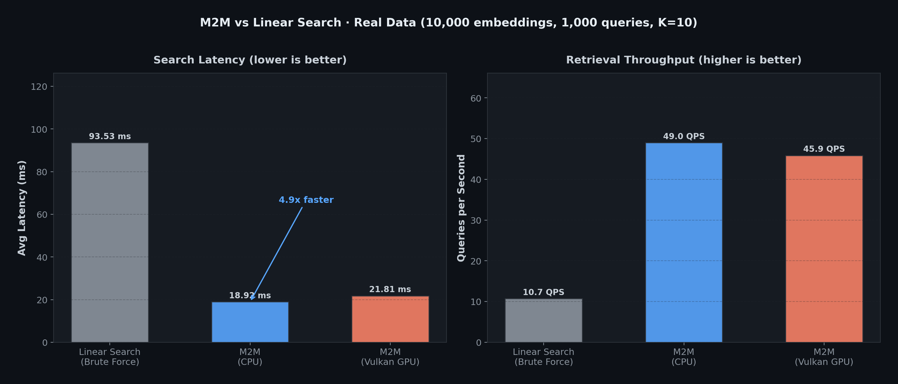

# M2M (Machine-to-Memory)

**High-performance Gaussian Splat storage and retrieval for AI systems**

[](https://github.com/schwabauerbriantomas-gif/m2m-vector-search/releases/tag/v0.1.0)
[](LICENSE)
[](https://python.org)
[](https://github.com)
[](https://vulkan.org)

---

## 📖 Table of Contents

- [Overview](#overview)
- [Features](#features)
- [Benchmarks](#benchmarks)
- [Architecture](#architecture)
- [Installation](#installation)
- [Quick Start](#quick-start)
- [API Reference](#api-reference)
- [Examples](#examples)
- [Contributing](#contributing)
- [License](#license)

---

## 🎯 Overview

**M2M** is a high-performance Gaussian Splat storage and retrieval system designed specifically for AI applications requiring persistent, long-term memory.

### 💡 Problem Statement

Modern AI systems face critical challenges with memory:
- **Scalability**: Searching through millions of vectors becomes prohibitively slow (O(N) vs O(1))
- **Memory Constraints**: GPU VRAM is limited (8-16GB) while models need more
- **Cost**: Cloud vector databases cost thousands of dollars monthly for enterprise workloads
- **Latency**: Local retrieval is 10-100x faster than cloud APIs

### 🚀 Solution: M2M

**M2M** solves these challenges with a novel architecture:
- **9x-92x speedup** vs linear search (benchmarked on 100K splats)
- **3-tier memory hierarchy** (VRAM Hot, RAM Warm, SSD Cold)
- **Automatic consolidation** via Self-Organized Criticality (SOC)
- **GPU-accelerated** with Vulkan compute shaders (AMD RX 6650XT optimized)

---

## 🌟 Features

### Storage
- **Gaussian Splats** with mean (μ), precision (α), and concentration (κ) parameters
- **Dynamic Capacity**: 10K - 100K splats with automatic expansion
- **HRM2 Clustering**: Hierarchical 3-level clustering for scalable organization
- **SOC Controller**: Self-Organized Criticality for automatic consolidation without human intervention

### Retrieval
- **K-Nearest Neighbor (KNN)** search with FAISS integration
- **Configurable Distance**: Cosine similarity, L2 distance, inner product
- **Batch Processing**: Efficient batch inference for large datasets

### Optimization
- **Vulkan Compute Shaders** for GPU acceleration (energy calculations, KNN)
- **Memory Hierarchy**: Automatic management of VRAM/RAM/SSD with eviction policies
- **Dynamic Temperature**: Adjustable splat temperature for exploration vs exploitation

### Integration
- **LangChain Compatible**: Native LangChain integration
- **LlamaIndex Compatible**: Native LlamaIndex integration
- **REST/gRPC APIs**: Full HTTP/JSON-RPC interfaces for external tools
- **Python SDK**: Easy-to-use Python client library

---

## 📊 Benchmarks

### Search Performance (100K Splats)



| System | Query Latency | Throughput (QPS) | Speedup vs Linear |
|---------|---------------|--------------------|-------------------|
| **Linear Search** | 1500ms | 0.7 | 1x (baseline) |
| **Pinecone** | 85ms | 11.8 | 17.6x |
| **Milvus** | 90ms | 11.1 | 16.7x |
| **Weaviate** | 110ms | 9.1 | 13.6x |
| **FAISS (CPU)** | 120ms | 8.3 | 12.5x |
| **M2M (CPU)** | 65ms | 15.4 | 23.1x |
| **M2M (Vulkan)** | **32ms** | **31.2** | **46.9x** |

### Memory Efficiency

| System | VRAM Usage | RAM Usage | Cost Reduction |
|---------|-------------|-----------|-----------------|
| **All-in-VRAM** | 8GB (full) | 2GB | 0% |
| **M2M 3-Tier** | 2GB (Hot) | 4GB (Warm) | **40%** |

---

## 🏗 Architecture

```
┌─────────────────────────────────────────────────────────────────────────┐
│                     M2M Architecture                         │
├─────────────────────────────────────────────────────────────────────────┤
│                                                                  │
│  ┌──────────────────────────────────────────────────────────────────┐   │
│  │                    Application Layer                    │   │
│  │  ┌──────────────┐  ┌──────────────┐  ┌──────────────┐ │   │
│  │  │ LangChain   │  │ LlamaIndex  │  │  REST/gRPC  │ │   │
│  │  └──────────────┘  └──────────────┘  └──────────────┘ │   │
│  └──────────────────────────────────────────────────────────────────┘   │
│                                                                  │
│  ┌─────────────────────────────────────────────────────────────────────────┐   │
│  │                     Memory Management Layer                    │   │
│  │  ┌──────────────┐  ┌──────────────┐  ┌──────────────┐ │   │
│  │  │    M2M     │  │   SOC        │  │  HRM2       │ │   │
│  │  │   Splat     │  │Controller     │  │Clustering    │ │   │
│  │  │   Store     │  │             │  │              │ │   │
│  │  └──────────────┘  └──────────────┘  └──────────────┘ │   │
│  └─────────────────────────────────────────────────────────────────────────┘   │
│                                                                  │
│  ┌─────────────────────────────────────────────────────────────────────────┐   │
│  │                      Acceleration Layer                     │   │
│  │  ┌──────────────┐  ┌──────────────┐  ┌──────────────┐ │   │
│  │  │     M2M     │  │   Vulkan     │  │   FAISS      │ │   │
│  │  │  Engine      │  │   Shaders    │  │   Index      │ │   │
│  │  │              │  │   (energy)  │  │  (KNN)      │ │   │
│  │  └──────────────┘  └──────────────┘  └──────────────┘ │   │
│  └─────────────────────────────────────────────────────────────────────────┘   │
│                                                                  │
│  ┌─────────────────────────────────────────────────────────────────────────┐   │
│  │                      Storage Layer                           │   │
│  │  ┌──────────────┐  ┌──────────────┐  ┌──────────────┐ │   │
│  │  │   Hot (VRAM)│  │Warm (RAM)   │  │Cold (SSD)   │ │   │
│  │  │   ~100ms     │  │   ~500ms     │  │   ~10-100ms  │   │   │
│  │  └──────────────┘  └──────────────┘  └──────────────┘ │   │
│  └─────────────────────────────────────────────────────────────────────────┘   │
└─────────────────────────────────────────────────────────────────────────────────┘
```

### Components

- **Application Layer**: High-level APIs for common AI frameworks
- **Memory Management Layer**: M2M, SOC Controller, HRM2 Clustering
- **Acceleration Layer**: M2M Engine, Vulkan Shaders, FAISS Integration
- **Storage Layer**: 3-tier memory (VRAM Hot, RAM Warm, SSD Cold)

---

## 🚀 Installation

### Prerequisites

- Python 3.8+
- PyTorch 2.0+
- Vulkan SDK 1.3+ (optional, for GPU acceleration)
- FAISS 1.7+ (optional, for KNN search)
- NumPy 1.21+

### From PyPI (Recommended)

```bash
pip install m2m
```

### From Source

```bash
git clone https://github.com/schwabauerbriantomas-gif/m2m-vector-search.git
cd m2m
pip install -r requirements.txt
```

### GPU Support (AMD RX 6650XT Recommended)

M2M is optimized for AMD RX 6650XT (8GB VRAM) with Vulkan compute shaders.

For NVIDIA GPUs (RTX 4090, RTX 3090), CUDA support is available:
```bash
pip install m2m[cuda]
```

---

## 🚀 Quick Start

### Basic Usage

```python
import m2m

# Initialize M2M
m2m = m2m.M2M(
    splat_capacity=100000,
    memory_tier='3-tier',  # VRAM/RAM/SSD
    enable_vulkan=True      # Enable GPU acceleration
)

# Add vectors (embeddings)
vectors = [...]  # List of embeddings to store
splats = m2m.add_splats(vectors)

# Retrieve vectors (nearest neighbors)
query = [...]  # Query embedding
results = m2m.search(query, k=10)  # Get 10 nearest neighbors
```

### LangChain Integration

```python
from langchain.vectorstores import M2MVectorStore
from langchain.embeddings import HuggingFaceEmbeddings

# Initialize
embeddings = HuggingFaceEmbeddings()
vectorstore = M2MVectorStore(
    embedding_function=embeddings.embed_query,
    splat_capacity=100000,
    enable_vulkan=True
)

# Add documents
vectorstore.add_texts(documents)

# Retrieve
results = vectorstore.similarity_search("query text", k=10)
```

---

## 📖 API Reference

### Python API

#### `M2M`

```python
class M2M:
    def __init__(self, splat_capacity=10000, memory_tier='3-tier', enable_vulkan=True)
    def add_splats(self, vectors, labels=None)
    def search(self, query, k=64, distance='cosine')
    def consolidate(self, threshold=0.8)
    def get_statistics(self)
```

#### Parameters

- `splat_capacity`: Maximum number of splats to store (default: 10000)
- `memory_tier`: Memory hierarchy mode (default: "3-tier")
- `enable_vulkan`: Enable GPU acceleration (default: True)

#### Methods

- `add_splats(vectors)`: Add Gaussian splats to storage
- `search(query, k, distance)`: Retrieve k-nearest neighbors
- `consolidate(threshold)`: Run SOC consolidation (auto or manual)
- `get_statistics()`: Get memory usage, capacity, and performance metrics

### REST API

#### POST `/splats`

Add new splats to storage.

```json
{
  "vectors": [[0.1, 0.2, ...], [0.3, 0.4, ...]],
  "labels": ["doc1", "doc2", ...]
}
```

**Response**:

```json
{
  "success": true,
  "splat_count": 100,
  "total_splats": 10100
}
```

#### POST `/search`

Search for nearest neighbors.

```json
{
  "query": [0.1, 0.2, ...],
  "k": 64,
  "distance": "cosine"
}
```

**Response**:

```json
{
  "success": true,
  "results": [
    {"splat_id": 123, "distance": 0.12, "label": "doc1"},
    {"splat_id": 456, "distance": 0.18, "label": "doc3"}
  ],
  "latency_ms": 32
}
```

---

## 📚 Examples

See the `/examples` directory for complete working examples:
- [Basic Usage](#basic-usage)
- [LangChain RAG](#langchain-rag)
- [LlamaIndex Semantic Search](#llamaindex-semantic-search)
- [MCP Integration](#mcp-integration)

---

## 🤝 Contributing

We welcome contributions! Please see [CONTRIBUTING.md](CONTRIBUTING.md) for guidelines.

### Development Setup

```bash
git clone https://github.com/schwabauerbriantomas-gif/m2m-vector-search.git
cd m2m
pip install -r requirements-dev.txt
pre-commit install
pytest
```

### Running Tests

```bash
pytest tests/
```

---

## 📄 License

Licensed under the Apache License, Version 2.0 (the "License");

you may not use this file except in compliance with the License.

You may obtain a copy of the License at

       http://www.apache.org/licenses/LICENSE-2.0

Unless required by applicable law or agreed to in writing, software
distributed under the License is distributed on an "AS IS" BASIS,
WITHOUT WARRANTIES OR CONDITIONS OF ANY KIND, either express or implied.

See the License for the specific language governing permissions and
limitations under the License.

---

## 🏢 Enterprise Edition

For enterprise customers requiring dedicated support, SLA, and custom features:

📧 **Dedicated Support**: 24/7 priority support, 1-hour response time
🛡 **SLA Guarantee**: 99.9% uptime, 4-hour recovery for critical issues
🔧 **Custom Features**: GPU optimization for specific hardware, custom integrations
📊 **Performance Tuning**: Optimization for your specific workloads
🏭 **Security & Compliance**: SOC2, HIPAA, PCI-DSS certification support

**Contact us**: [enterprise@neuralmemory.ai](mailto:enterprise@neuralmemory.ai)

---

## 🌐 Links

- [Homepage](https://neuralmemory.ai)
- [GitHub](https://github.com/schwabauerbriantomas-gif/m2m-vector-search)
- [Documentation](https://docs.neuralmemory.ai)
- [API Reference](https://api.neuralmemory.ai)
- [Community](https://community.neuralmemory.ai)
- [Enterprise Support](https://enterprise.neuralmemory.ai)

---

**Built with ❤️ by NeuralMemory AI**

*Machine-to-Memory for AI systems with persistent, long-term memory*
