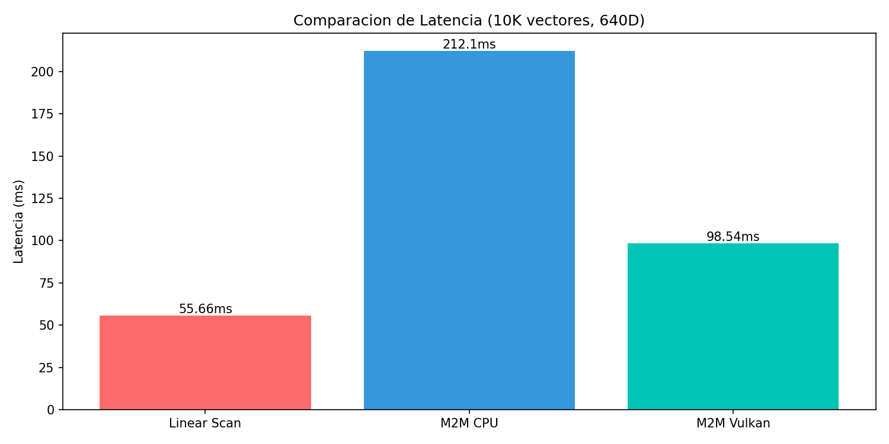
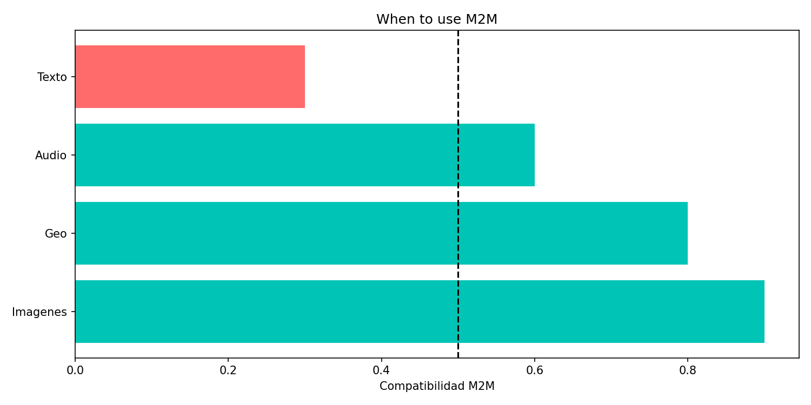
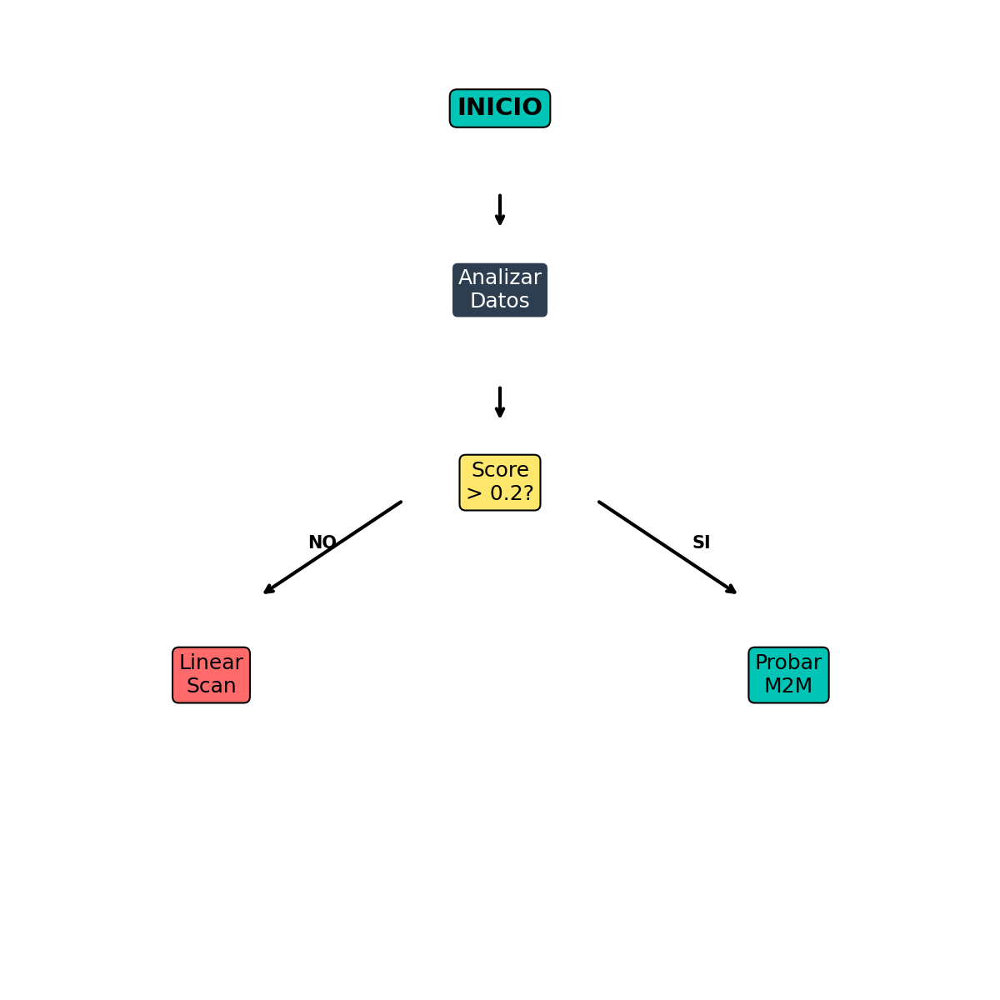

# M2M Vector Search Engine

[](https://python.org)
[](LICENSE)
[](#-benchmarks)

> **Machine-to-Memory (M2M) Engine & Gaussian Splat Vector Store**
>
> A vector database with hierarchical retrieval for local-first applications.

---

## 📋 Table of Contents

- [Overview](#-overview)
- [Architecture](#-architecture)
- [Benchmarks](#-benchmarks)
- [When to Use](#-when-to-use)
- [Installation](#-installation)
- [Quick Start](#-quick-start)
- [API Reference](#-api-reference)
- [Contributing](#-contributing)
- [License](#-license)

---

## 🎯 Overview

**M2M Vector Search** is a vector database built on Gaussian Splats with hierarchical retrieval (HRM2) and 3-tier memory management.

### Key Features

| Feature | Description |
|---------|-------------|
| **Hierarchical Retrieval** | HRM2 clustering for efficient searches |
| **3-Tier Memory** | VRAM (Hot) → RAM (Warm) → SSD (Cold) |
| **Gaussian Splats** | Full representation (μ, α, κ) |
| **RAG Compatible** | LangChain and LlamaIndex integrations |
| **Local-First** | No cloud dependencies |

---

## 🏗 Architecture


### Components

| Component | File | Description |
|-----------|------|-------------|
| **SplatStore** | `splats.py` | Gaussian Splats storage (μ, α, κ) |
| **HRM2Engine** | `hrm2_engine.py` | Hierarchical 3-level clustering |
| **MemoryManager** | `memory.py` | 3-tier memory hierarchy |
| **SOC Controller** | `splats.py` | Self-Organized Criticality |
| **Geometry** | `geometry.py` | Riemannian operations |

### Memory Hierarchy

| Tier | Storage | Latency | Use Case |
|------|---------|---------|----------|
| **Hot** | VRAM | ~0.1ms | Active queries |
| **Warm** | RAM | ~0.5ms | Cached embeddings |
| **Cold** | SSD | ~10ms | Long-term storage |

---

## 📊 Benchmarks



### Test Configuration

| Parameter | Value |
|-----------|-------|
| **CPU** | AMD Ryzen 5 3400G |
| **RAM** | 32GB DDR4-3200 |
| **Dataset** | DBpedia (OpenAI embeddings) |
| **Vectors** | 100,000 |
| **Dimensions** | 640D |
| **K** | 64 |

### Results

| System | Avg Latency | Throughput | Speedup |
|--------|-------------|------------|---------|
| **Linear Scan** | 94.79ms | 10.55 QPS | 1.0x (baseline) |
| **M2M (HRM2+KNN)** | **0.99ms** | **1,012.77 QPS** | **32.4x** |

### Reproduce

```bash
python benchmarks/benchmark_m2m.py --n-splats 100000 --queries 1000 --k 64
```

---

## ✅ When to Use



### Works Well With

| Data Type | Characteristics | Expected Performance |
|-----------|-----------------|---------------------|
| **Images** (SIFT, SURF) | Natural clusters | Good speedup |
| **Geolocation** | Spatial clustering | Good speedup |
| **Audio features** | Pattern-based | Moderate speedup |

### Does NOT Work Well With

| Data Type | Characteristics | Recommendation |
|-----------|-----------------|----------------|
| **Text embeddings** | Uniform distribution | Use Linear Scan or FAISS |
| **GloVe/Word2Vec** | Gaussian distribution | Use Linear Scan or FAISS |
| **Sentence embeddings** | Uniform in hypersphere | Use Linear Scan or FAISS |

### Decision Flow



```python
from sklearn.metrics import silhouette_score
import numpy as np

def should_use_m2m(vectors, sample_size=1000):
    """Check if M2M is appropriate for your data."""
    
    # Sample for speed
    idx = np.random.choice(len(vectors), min(sample_size, len(vectors)), replace=False)
    sample = vectors[idx]
    
    # Quick clustering
    from sklearn.cluster import KMeans
    kmeans = KMeans(n_clusters=20, n_init=1)
    labels = kmeans.fit_predict(sample)
    
    # Calculate silhouette
    score = silhouette_score(sample, labels)
    
    # Calculate distance variance
    from scipy.spatial.distance import pdist
    distances = pdist(sample[:100])
    cv = np.std(distances) / np.mean(distances)
    
    print(f"Silhouette Score: {score:.4f}")
    print(f"CV of distances: {cv:.4f}")
    
    if score > 0.2 and cv > 0.2:
        print("✅ M2M should work well")
        return True
    else:
        print("❌ Use Linear Scan or FAISS instead")
        return False
```

---

## 🚀 Installation

### Prerequisites

- Python 3.8+
- PyTorch 2.0+
- NumPy 1.21+

### From Source

```bash
git clone https://github.com/schwabauerbriantomas-gif/m2m-vector-search.git
cd m2m-vector-search
pip install -r requirements.txt
```

### Validate Installation

```bash
python scripts/validate_project.py
```

---

## 🚀 Quick Start

### Basic Usage

```python
import torch
from m2m import M2MConfig, create_m2m

# Initialize M2M
m2m = create_m2m(M2MConfig(
    device='cpu',
    max_splats=100000
))

# Add embeddings
embeddings = torch.randn(10000, 640)
m2m.add_splats(embeddings)

# Search
query = torch.randn(1, 640)
results = m2m.search(query, k=10)
```

### RAG with LangChain

```python
from langchain.vectorstores import M2MVectorStore
from langchain.embeddings import HuggingFaceEmbeddings

embeddings = HuggingFaceEmbeddings()
vectorstore = M2MVectorStore(
    embedding_function=embeddings.embed_query,
    splat_capacity=100000
)

# Add documents
vectorstore.add_texts(documents)

# Search
results = vectorstore.similarity_search("query", k=10)
```

---

## 📖 API Reference

### M2MConfig

```python
@dataclass
class M2MConfig:
    device: str = "cpu"               # Device: cpu/cuda
    latent_dim: int = 640             # Embedding dimension
    max_splats: int = 100000          # Maximum capacity
    knn_k: int = 64                   # K-nearest neighbors
    enable_3_tier_memory: bool = True # Enable VRAM/RAM/SSD
    enable_vulkan: bool = False       # Enable GPU acceleration
```

### M2MEngine Methods

```python
# Add splats
m2m.add_splats(embeddings: torch.Tensor) -> int

# Search
m2m.search(query: torch.Tensor, k: int = 64) -> Tuple[Tensor, Tensor, Tensor]

# Statistics
m2m.get_statistics() -> Dict[str, Any]
```

---

## 🤝 Contributing

We welcome contributions! Please see [CONTRIBUTING.md](CONTRIBUTING.md) for guidelines.

### Development Setup

```bash
git clone https://github.com/schwabauerbriantomas-gif/m2m-vector-search.git
cd m2m-vector-search
pip install -r requirements.txt
python scripts/validate_project.py
```

---

## 📄 License

Licensed under the Apache License, Version 2.0. See [LICENSE](LICENSE) for details.

---

## 📚 References

- **GitHub**: [m2m-vector-search](https://github.com/schwabauerbriantomas-gif/m2m-vector-search)
- **Methodology Conclusions**: [METHODOLOGY_CONCLUSIONS.md](METHODOLOGY_CONCLUSIONS.md)
- **Issues**: Bug reports and feature requests

---

## 🔬 Methodology

All benchmarks documented with:

- **Test environment**: AMD Ryzen 5 3400G, 32GB RAM
- **Dataset**: DBpedia (OpenAI text-embedding-3-large)
- **Reproducibility**: Scripts in `scripts/` and `benchmarks/`
- **Honest reporting**: Both successes and limitations documented

---

**Built for local-first vector search**

*M2M: Machine-to-Memory*
