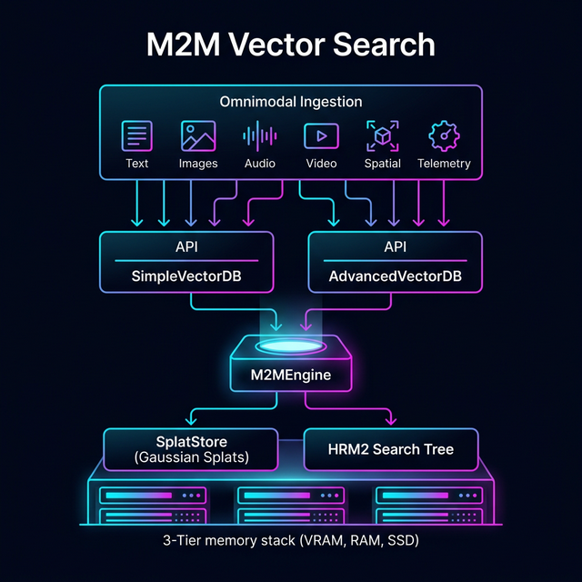
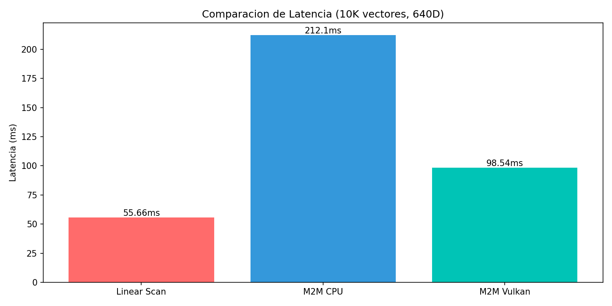

# M2M EBM Vector Database

[](https://python.org)
[](https://github.com/schwabauerbriantomas-gif/m2m-vector-search)
[](https://github.com/schwabauerbriantomas-gif/m2m-vector-search/actions/workflows/ci.yml)
[](https://badge.fury.io/py/m2m-vector-search)
[](https://codecov.io/gh/schwabauerbriantomas-gif/m2m-vector-search)

> **M2M — Energy-Based Model (EBM) Vector Database**
>
> A production-ready vector database powered by Gaussian Splats and hierarchical retrieval (HRM2), extended in v2.0 with a full Energy-Based Model layer: Write-Ahead Logging, complete CRUD, Self-Organized Criticality, and an energy-aware REST API.

---

## 📋 Table of Contents

- [What's New in v2.0](#-whats-new-in-v20)
- [Overview](#-overview)
- [Quick Start](#-quick-start)
- [Two Modes of Operation](#-two-modes-of-operation)
- [EBM Features](#-ebm-features)
- [REST API](#-rest-api)
- [Distributed Cluster & Energy Router](#-distributed-cluster--energy-router)
- [Integrations](#-integrations)
- [Architecture](#-architecture)
- [Comparison](#️-comparison-with-other-vector-dbs)
- [Benchmarks](#-benchmarks)
- [Installation](#-installation)
- [Troubleshooting](#️-troubleshooting)
- [License](#-license)

---

## 🆕 What's New in v2.0

| Feature | Description |
|---------|-------------|
| **Full CRUD** | `add/update/delete` with ids, metadata, documents and metadata filters |
| **Write-Ahead Log** | Durable `msgpack`/JSON WAL + SQLite metadata persistence |
| **EBM Energy API** | `E(x)`, gradient, free energy, local 2D maps |
| **Exploration API** | High-uncertainty regions, Boltzmann sampling, agent suggestions |
| **SOC Engine** | Self-Organized Criticality: avalanche dynamics & system relaxation |
| **REST API v2** | Collections-based, full CRUD + EBM endpoints |
| **Energy Router** | 5 routing strategies for distributed clusters |

---

## 🎯 Overview

**M2M** is a vector database built on Gaussian Splats with hierarchical retrieval (HRM2). Version 2.0 adds a complete Energy-Based Model layer, turning it into a **living, self-organizing database** that understands the energy landscape of its data.

### Core Engine Features

| Feature | Description |
|---------|-------------|
| **Hierarchical Retrieval (HRM2)** | Two-level clustering (coarse → fine) for sub-millisecond searches |
| **Gaussian Splats** | Full latent representation (μ, α, κ) |
| **EBM Layer** | Energy landscape, exploration, Self-Organized Criticality |
| **Local-First** | No cloud dependencies, pure Python/NumPy |
| **GPU Acceleration** | Optional Vulkan compute shader (cross-platform) |

---

## ⚡ Quick Start

```bash
pip install m2m-vector-search
```

```python
import numpy as np
from m2m import SimpleVectorDB

# Initialize (supports 'edge', 'standard', 'ebm' modes)
db = SimpleVectorDB(latent_dim=768, mode='standard')

# Add with metadata
db.add(
    ids=['doc1', 'doc2', 'doc3'],
    vectors=np.random.randn(3, 768).astype(np.float32),
    metadata=[{'category': 'tech'}, {'category': 'science'}, {'category': 'tech'}],
    documents=['Doc 1 text', 'Doc 2 text', 'Doc 3 text']
)

# Search with metadata filter
results = db.search(query, k=5, filter={'category': {'$eq': 'tech'}}, include_metadata=True)

# Update a document
db.update('doc1', metadata={'category': 'technology', 'reviewed': True})

# Soft-delete
db.delete(id='doc2')

# Hard-delete all docs matching a filter  
db.delete(filter={'category': {'$eq': 'science'}}, hard=True)
```

---

## 🌓 Two Modes of Operation

### 1. SimpleVectorDB
*"The SQLite of Vector DBs"*

Edge-optimized. Full CRUD. Optional EBM and persistence.

```python
from m2m import SimpleVectorDB

# Edge mode (minimal overhead, no WAL)
db = SimpleVectorDB(latent_dim=768, mode='edge')

# Standard mode (WAL + SQLite persistence)
db = SimpleVectorDB(latent_dim=768, mode='standard', storage_path='./data')

# EBM mode (full energy landscape features)
db = SimpleVectorDB(latent_dim=768, mode='ebm', storage_path='./data')

db.add(ids=['doc1'], vectors=vectors, metadata=[{'cat': 'tech'}])
results = db.search(query, k=10, include_metadata=True)
db.update('doc1', metadata={'cat': 'technology'})
db.delete(id='doc1')
```

### 2. AdvancedVectorDB
*"The Cognitive Latent Space"*

Autonomous agents. Full EBM features. Self-Organized Criticality.

```python
from m2m import AdvancedVectorDB

db = AdvancedVectorDB(latent_dim=768, enable_soc=True, enable_energy_features=True)
db.add(ids=['doc1'], vectors=vectors)

# SOC mechanics
report = db.check_criticality()
result = db.trigger_avalanche()
relax_result = db.relax(iterations=10)

# EBM search
sr = db.search_with_energy(query, k=10)
print(f"Query energy: {sr.query_energy:.4f}")
```

### 3. M2M Cluster
*"The Distributed Vector Network"*

Horizontal scalability with optional energy-aware routing.

```python
from m2m import M2MConfig
from m2m.cluster import EdgeNode, ClusterRouter, M2MClusterClient

config = M2MConfig(device='cpu')
edge1 = EdgeNode(edge_id="edge-1", config=config)
edge2 = EdgeNode(edge_id="edge-2", config=config)

router = ClusterRouter(energy_router_config={
    'enabled': True,
    'strategy': 'hybrid'
})
client = M2MClusterClient(in_memory_router=router)
client.register_local_edge(edge1)
client.register_local_edge(edge2)

client.ingest(np.random.randn(1000, 768).astype(np.float32))
results = client.search(query, k=10)
```

---

## ⚡ EBM Features

### Energy Landscape

```python
from m2m import SimpleVectorDB

db = SimpleVectorDB(latent_dim=768, mode='ebm')
db.add(ids=ids, vectors=vectors)

# Get energy of a vector
energy = db.get_energy(query_vector)

# Search with energy information
sr = db.search_with_energy(query, k=10)
for r in sr.results:
    print(f"{r.id}: score={r.score:.4f}, energy={r.energy:.4f}, confidence={r.confidence:.4f}")

# Find knowledge gaps (high-uncertainty regions)
gaps = db.find_knowledge_gaps(n=5)

# Agent exploration suggestions
suggestions = db.suggest_exploration(n=3)
```

### Self-Organized Criticality (SOC)

SOC keeps the database in a state of maximum information capacity — automatically identifying and resolving over-dense memory regions through Bak-Tang-Wiesenfeld avalanche dynamics.

```python
from m2m import AdvancedVectorDB

db = AdvancedVectorDB(latent_dim=768, enable_soc=True)
db.add(ids=ids, vectors=vectors)

# Check system criticality
report = db.check_criticality()
# report.state: 'subcritical' | 'critical' | 'supercritical'
print(f"System state: {report.state}, index: {report.index:.4f}")

# Trigger avalanche to redistribute memory
avalanche = db.trigger_avalanche()
print(f"Affected clusters: {avalanche.affected_clusters}, energy released: {avalanche.energy_released:.4f}")

# Relax system to stable state
relax = db.relax(iterations=20)
print(f"Energy: {relax.initial_energy:.4f} → {relax.final_energy:.4f}")
```

---

## 🌐 REST API

The REST API follows a collections-based architecture (v1):

```bash
# Start the server
uvicorn m2m.api.edge_api:app --port 8000
```

### Collections

```http
POST   /v1/collections          # Create collection
GET    /v1/collections/{name}   # Get collection info
DELETE /v1/collections/{name}   # Delete collection
```

### Vectors (CRUD)

```http
POST   /v1/collections/{name}/vectors          # Add vectors
PUT    /v1/collections/{name}/vectors/{id}     # Update vector
DELETE /v1/collections/{name}/vectors/{id}     # Delete vector
POST   /v1/collections/{name}/search           # Search with filters
```

### EBM Endpoints

```http
POST /v1/collections/{name}/energy    # Get energy for a vector
POST /v1/collections/{name}/explore   # Find high-uncertainty regions
GET  /v1/collections/{name}/suggest   # Agent exploration suggestions
GET  /v1/collections/{name}/stats     # Collection statistics
```

### Admin

```http
POST /v1/admin/checkpoint   # WAL checkpoint
POST /v1/admin/backup       # Backup collections
```

### Example

```python
import requests, numpy as np

BASE = "http://localhost:8000"

# Create collection
requests.post(f"{BASE}/v1/collections", json={"name": "docs", "dimension": 768})

# Add vectors
vectors = np.random.randn(5, 768).astype(np.float32).tolist()
requests.post(f"{BASE}/v1/collections/docs/vectors", json={
    "ids": ["d1", "d2", "d3", "d4", "d5"],
    "vectors": vectors,
    "metadata": [{"category": "tech"}] * 5
})

# Search with filter
query = np.random.randn(768).astype(np.float32).tolist()
resp = requests.post(f"{BASE}/v1/collections/docs/search", json={
    "query": query, "k": 3, "filter": {"category": {"$eq": "tech"}}
})
```

---

## 🏗 Distributed Cluster & Energy Router

`ClusterRouter` now optionally wraps `EnergyRouter` for energy-aware distributed routing:

| Strategy | Description |
|----------|-------------|
| `energy_balanced` | Boltzmann probability — lower energy = higher selection chance |
| `round_robin` | Uniform sequential distribution |
| `least_loaded` | Node with fewest active queries |
| `locality_aware` | Prefers nodes familiar with the query region |
| `hybrid` | 40% energy + 20% load + 30% locality + 10% latency |

```python
from m2m.cluster import ClusterRouter

router = ClusterRouter(energy_router_config={
    'enabled': True,
    'strategy': 'hybrid',
    'cache_energy': True,
    'cache_ttl_seconds': 60,
})
router.register_edge("edge-1", "http://edge1:8000", weight=1.0)
router.register_edge("edge-2", "http://edge2:8000", weight=2.0)

# Energy router automatically selects best node
selected = router.route_query(query_vector, k=10)
```

---

## 🌐 Omnimodal & Multimodal

M2M stores vectors from any modality. Pair with any embedding model:

| Modality | Recommended Model |
|----------|------------------|
| **Text** | OpenAI `text-embedding-3`, BGE, MiniLM |
| **Images** | CLIP, SigLIP |
| **Audio** | ImageBind, Whisper encoders |
| **Video** | VideoMAE, ImageBind |
| **Spatial/3D** | PointNet++, 3D Gaussian Splatting |

---

## 🔗 Integrations

### LangChain

```python
from langchain.vectorstores import M2MVectorStore
from langchain.embeddings import HuggingFaceEmbeddings

embeddings = HuggingFaceEmbeddings(model_name="sentence-transformers/all-MiniLM-L6-v2")
vectorstore = M2MVectorStore(embedding_function=embeddings.embed_query, splat_capacity=100000)
vectorstore.add_texts(["Document 1", "Document 2"])
results = vectorstore.similarity_search("Query", k=5)
```

### LlamaIndex

```python
from llamaindex import VectorStoreIndex, SimpleDirectoryReader
from m2m.integrations.llamaindex import M2MVectorStore

documents = SimpleDirectoryReader("./docs").load_data()
vectorstore = M2MVectorStore(latent_dim=640, max_splats=100000)
index = VectorStoreIndex.from_documents(documents, vector_store=vectorstore)
response = index.as_query_engine().query("Your search query")
```

### Knowledge Graphs

```python
from m2m.graph_splat import GaussianGraphStore
from m2m.entity_extractor import M2MEntityExtractor, M2MGraphEntityExtractor

store = GaussianGraphStore(dim=640)
pipeline = M2MGraphEntityExtractor(M2MEntityExtractor(), store)
doc_id = store.add_document("Apple Inc. reported strong earnings.", embedding)
pipeline.extract_and_store(text="...", doc_embedding=embedding, doc_id=doc_id)
```

---

## 🏗 Architecture



### Storage Layers (v2.0)

| Layer | Technology | Purpose |
|-------|-----------|---------|
| **WAL** | msgpack / JSON | Durable operation logging, crash recovery |
| **Vectors** | NumPy shards | Fast matrix operations |
| **Metadata** | SQLite | Structured metadata queries and filters |
| **Index** | Pickle | HRM2 cluster state serialization |

### 3-Tier Memory (Advanced Mode)

| Tier | Storage | Latency |
|------|---------|---------|
| **Hot** | VRAM | ~0.1ms |
| **Warm** | RAM | ~0.5ms |
| **Cold** | SSD | ~10ms |

---

## ⚖️ Comparison with other Vector DBs

| Feature | M2M v2.0 | FAISS | Pinecone | Chroma |
|---------|----------|-------|----------|--------|
| **Deployment** | Local / Edge | Local | Cloud | Local / Server |
| **CRUD** | ✅ Full (ids, metadata, filters) | ❌ | ✅ | ✅ |
| **EBM / Energy** | ✅ | ❌ | ❌ | ❌ |
| **SOC Memory** | ✅ | ❌ | ❌ | ❌ |
| **WAL Durability** | ✅ | ❌ | ✅ | ✅ |
| **REST API** | ✅ Collections-based | ❌ | ✅ | ✅ |
| **GPU Support** | Vulkan (cross-platform) | CUDA (NVIDIA) | N/A | N/A |
| **Offline** | ✅ 100% | ✅ | ❌ | ✅ |

---

## 📊 Benchmarks



| System | Avg Latency | Throughput | Speedup |
|--------|-------------|------------|---------|
| **Linear Scan** | 47.80ms | 20.92 QPS | 1.0x |
| **M2M CPU** | 81.03ms | 12.34 QPS | 0.6x |
| **M2M Transformed** | **8.68ms** | **115.20 QPS** | **5.5x** |

*(10K vectors, 640D, dual-core edge device)*

> **LSH Note**: For purely homogeneous distributions, enable `enable_lsh_fallback=True` to activate Cross-Polytope LSH pre-filtering. Alternatively use `M2MDatasetTransformer` to induce clustering structure.

```bash
python benchmarks/run_benchmark.py --dataset sklearn --n-splats 10000 --n-queries 1000 --k 10 --device all
```

---

## 🚀 Installation

### Requirements

| Component | Minimum |
|-----------|---------|
| Python | 3.8+ |
| NumPy | 1.21+ |
| scikit-learn | 1.2+ |
| msgpack | 1.0+ |
| FastAPI | 0.100+ |
| uvicorn | 0.23+ |

### From pip

```bash
pip install m2m-vector-search
```

### From source

```bash
git clone https://github.com/schwabauerbriantomas-gif/m2m-vector-search.git
cd m2m-vector-search
pip install -e ".[dev]"
pytest tests/
```

---

## 🛠️ Troubleshooting

See [Troubleshooting Guide](docs/TROUBLESHOOTING.md) for common issues.

---

## 📄 License & References

Licensed under the **AGPLv3**.

- **Changelog**: [CHANGELOG.md](CHANGELOG.md)
- **Security Policy**: [SECURITY.md](SECURITY.md)
- **Methodology**: [METHODOLOGY_CONCLUSIONS.md](METHODOLOGY_CONCLUSIONS.md)
- **Config Guide**: [CONFIG_RAG.md](CONFIG_RAG.md)

---
*M2M v2.0 — Machine-to-Memory, Energy-to-Intelligence*
