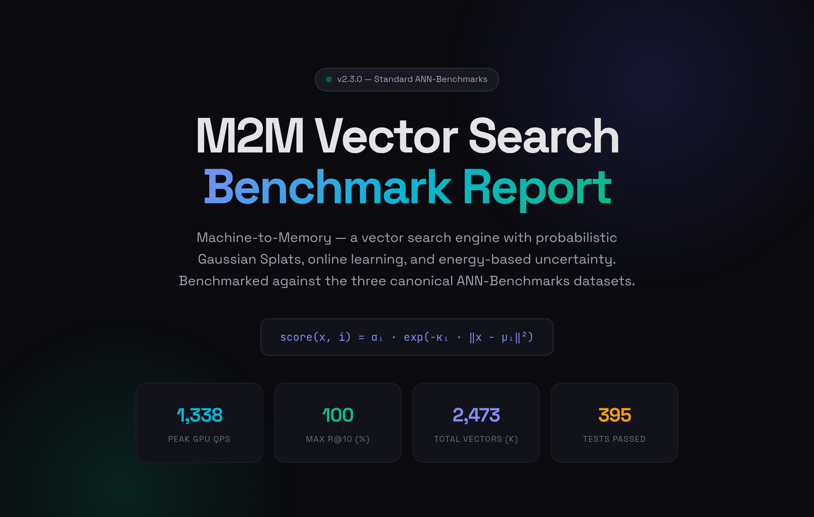
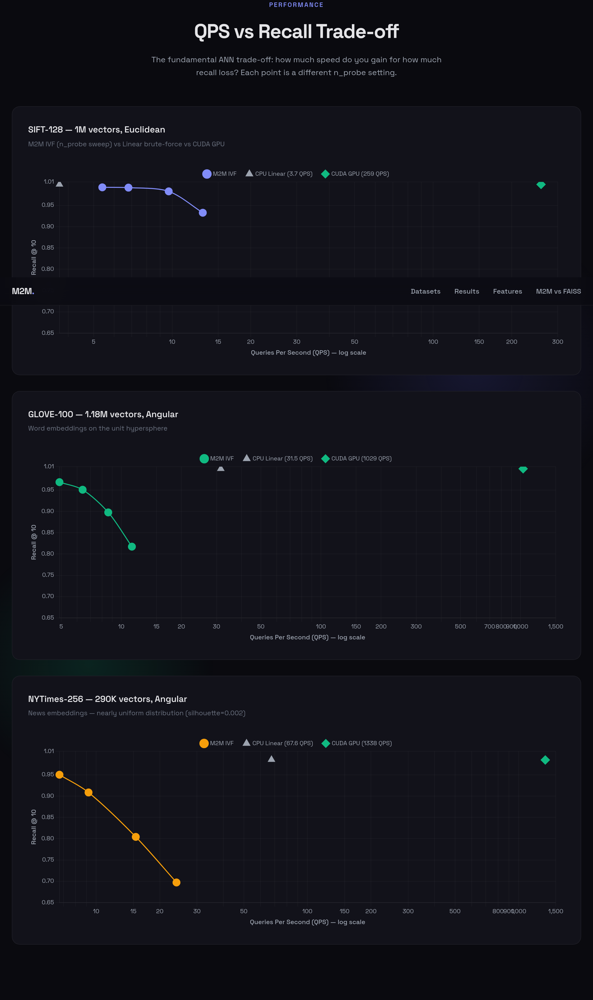
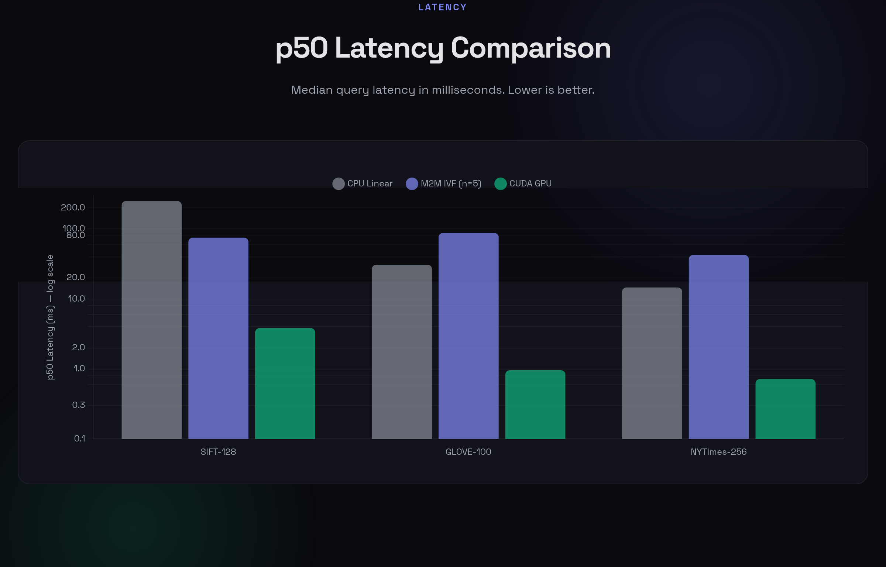
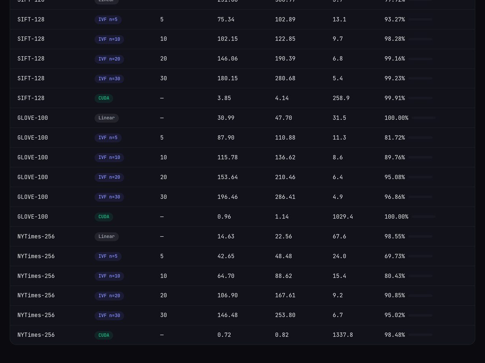
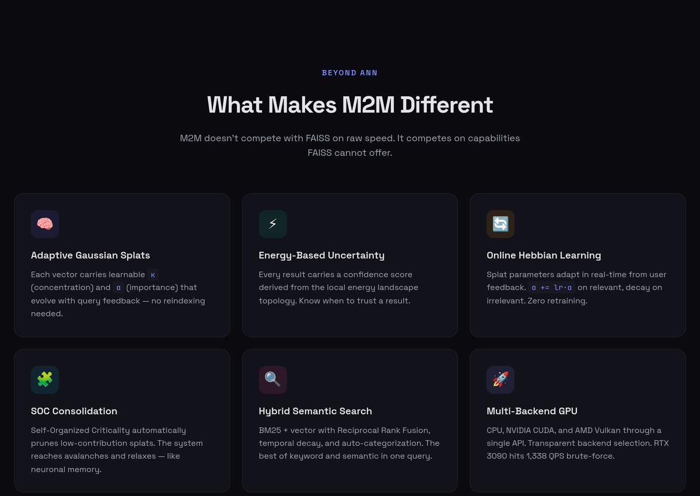
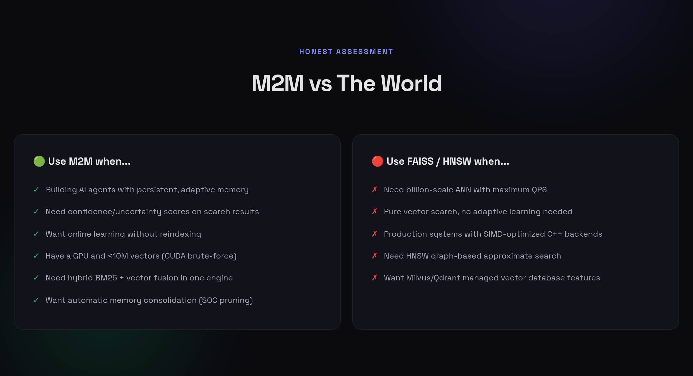

<p align="center">
  
  
  
  
  
</p>

<h1 align="center">M2M Vector Search</h1>

<p align="center">
  <strong>Machine-to-Memory</strong> &mdash; A vector search engine with probabilistic Gaussian Splats,
  online learning via feedback, energy-based uncertainty quantification, and multi-backend GPU acceleration.
</p>

<p align="center">
  <a href="#quick-start">Quick Start</a> &bull;
  <a href="#features">Features</a> &bull;
  <a href="#architecture">Architecture</a> &bull;
  <a href="#semantic-memory">Semantic Memory</a> &bull;
  <a href="#benchmarks">Benchmarks</a> &bull;
  <a href="#presentation">📊 Presentation</a> &bull;
  <a href="#changelog">Changelog</a>
</p>

---

## Interactive Benchmark Presentation

📊 **[Open the interactive report →](presentation.html)** (opens in any browser, no server needed)

A NotebookLM-style visual dashboard with animated charts, QPS-vs-Recall scatter plots, latency comparisons, and the complete results table — all data-driven, zero fabricated numbers.

<details>
<summary><strong>📷 Click to view presentation screenshots</strong></summary>

**Hero & Summary Stats**



**ANN-Benchmarks Datasets**


**QPS vs Recall — All 3 datasets**



**Latency Comparison (log scale)**



**Complete Results Table**



**Features & M2M vs FAISS**



**When to Use What**



</details>

---

## Features

- **Gaussian Splats** — Each vector is represented as a learnable Gaussian: `score(x, i) = αᵢ · exp(-κᵢ · ‖x − μᵢ‖²)`. Three parameters (μ, κ, α) encode position, concentration, and importance independently.
- **Online Learning** — Hebbian update rules adapt splat parameters from user feedback after each query. No retraining, no re-indexing.
- **Energy-Based Model** — Native uncertainty quantification via an energy landscape. Every search result carries a confidence score derived from the local energy topology.
- **HRM2 Engine** — Hierarchical Routing with Mixture Models and adaptive probing for sub-linear search at scale.
- **SOC Consolidation** — Self-Organized Criticality automatically prunes low-contribution splats. The system reaches avalanches and relaxes to equilibrium, mimicking neuronal memory consolidation.
- **Multi-GPU Backend** — CPU, NVIDIA CUDA, and AMD Vulkan through a single API. Backend selection is transparent.
- **Semantic Memory** — Hybrid BM25 + vector search with Reciprocal Rank Fusion, temporal decay, and auto-categorization.
- **LangChain Integration** — Native `BaseRetriever` implementation with full CRUD support.
- **Edge / Cluster** — Distributed mode with edge nodes, a coordinator, load balancing, and sharding.

---

## Quick Start

### Install

```bash
pip install m2m-vector-search
```

### Minimal Example

```python
from m2m import SimpleVectorDB
import numpy as np

db = SimpleVectorDB(latent_dim=128)

vectors = np.random.randn(1000, 128).astype(np.float32)
db.add(vectors=vectors, ids=[f"doc_{i}" for i in range(1000)])

query = np.random.randn(128).astype(np.float32)
results = db.search(query, k=10, include_metadata=True)

for r in results:
    print(f"  {r.id}: score={r.score:.4f}")
```

### Advanced: Gaussian Splats + Energy

`AdvancedVectorDB` adds energy-based uncertainty, SOC consolidation, and Langevin exploration:

```python
from m2m import AdvancedVectorDB
import numpy as np

db = AdvancedVectorDB(latent_dim=128)
vectors = np.random.randn(500, 128).astype(np.float32)
db.add(ids=[f"item_{i}" for i in range(500)], vectors=vectors)

query = np.random.randn(128).astype(np.float32)

# Search with energy + confidence scores
result = db.search_with_energy(query, k=10)
for r in result.results:
    print(f"  {r.id}: score={r.score:.4f}  "
          f"energy={r.energy:.4f}  confidence={r.confidence:.4f}")

# SOC consolidation: prune low-α splats
removed = db.consolidate()
print(f"Consolidated {removed} splats")

# Check system criticality
report = db.check_criticality()
print(f"Criticality index: {report.index:.4f}  state: {report.state}")
```

**Update rules (Hebbian + temporal decay):**

| Event | α (importance) | κ (concentration) | μ (position) |
|-------|:-:|:-:|:-:|
| Relevant feedback | `α += lr_α · α` | `κ += lr_κ · ‖x − μ‖⁻²` | `μ += lr_μ · (x − μ)` |
| Irrelevant feedback | `α *= (1 − lr_α)` | `κ -= 0.5 · lr_κ` | — |
| Temporal decay | `α *= exp(-λ·Δt)` | — | — |

---

## Architecture

```
┌─────────────────────────────────────────────────────┐
│                   REST API (FastAPI)                 │
│            Collections · CRUD · Search               │
├─────────────────────────────────────────────────────┤
│           SemanticMemoryDB / VectorDB                │
│      Hybrid Search · Fusion · Temporal Decay         │
├──────────┬──────────┬───────────┬───────────────────┤
│  Splats  │  HRM2    │  EBM      │  SOC              │
│  (μ,κ,α) │  Engine  │  Energy   │  Consolidate      │
├──────────┴──────────┴───────────┴───────────────────┤
│              Backend Layer (pluggable)               │
├─────────┬──────────┬──────────┬─────────────────────┤
│   CPU   │  CUDA    │  Vulkan  │  Transformed        │
├─────────┴──────────┴──────────┴─────────────────────┤
│              Storage Layer                           │
├─────────┬─────────────────┬─────────────────────────┤
│  WAL    │  Persistence    │  GPUVectorIndex         │
│         │  (SQLite+NPY)   │                         │
├─────────┴─────────────────┴─────────────────────────┤
│              Cluster / Edge Layer                    │
├──────────┬───────────┬──────────┬───────────────────┤
│  Router  │  Balancer │  Sharding│  Edge Nodes       │
└──────────┴───────────┴──────────┴───────────────────┘
```

### Module Map

| Module | Responsibility |
|--------|----------------|
| `splats.py` | Gaussian Splat tensor management, `find_neighbors`, `feedback` |
| `hrm2_engine.py` | Hierarchical routing, adaptive probing, coarse-to-fine search |
| `gaussian_scoring.py` | Two-phase scoring: L2 retrieval + Gaussian re-ranking |
| `geometry.py` | Riemannian operations on the hypersphere (exp_map, log_map) |
| `ebm/energy_api.py` | Energy landscape computation, uncertainty quantification |
| `ebm/soc.py` | Self-Organized Criticality: avalanches, relaxation, consolidation |
| `ebm/exploration.py` | Langevin dynamics exploration, Boltzmann sampling |
| `semantic_memory.py` | Hybrid BM25 + vector, RRF fusion, temporal decay |
| `dataset_transformer.py` | Raw vectors → Gaussian Splats via KMeans clustering |
| `query_optimizer.py` | Query prefetching with bigram transition model |
| `encoding.py` | Color histogram + positional encoding for multi-modal splats |
| `storage/persistence.py` | SQLite metadata + NPY shards + HMAC-signed index |
| `storage/wal.py` | Write-Ahead Log for crash recovery |
| `api/edge_api.py` | FastAPI REST endpoints with configurable CORS |
| `cluster/` | Distributed mode: router, balancer, edge nodes, sharding |
| `lsh_index.py` | Cross-Polytope LSH fallback for uniform distributions |

---

## Semantic Memory

```python
from m2m.semantic_memory import SemanticMemoryDB

# Use any encoder that returns a numpy float32 vector
from sentence_transformers import SentenceTransformer
model = SentenceTransformer("BAAI/bge-small-en-v1.5")
encoder = lambda text: model.encode(text, show_progress_bar=False)

mem = SemanticMemoryDB(
    encoder=encoder,
    latent_dim=384,
    fusion_method="rrf",
    temporal_decay=True,
    temporal_half_life_days=30.0,
    auto_categorize=True,
)

mem.store("User prefers dark mode for coding", metadata={"category": "preference"})
mem.store("We decided to use Qdrant for production", metadata={"category": "decision"})

results = mem.search("what did we decide about databases?", k=5)
```

### Hybrid Search Fusion Methods

| Method | Tuning Required | Best For |
|--------|:-:|----------|
| **RRF** (Reciprocal Rank Fusion) | No | General-purpose (recommended) |
| **Weighted** | Yes | Domain-specific with known priorities |
| `vector_only` | No | Pure semantic search |
| `bm25_only` | No | Pure keyword search |

---

## Security

- **Restricted Unpickler** — All `pickle.loads()` calls are replaced with a whitelist-based `_RestrictedUnpickler` that blocks `os.system`, `subprocess`, `eval`, and any non-numpy/non-builtin class. Prevents arbitrary code execution from tampered cache or index files.
- **HMAC-Signed Index** — `save_index()` / `load_index()` verify an HMAC-SHA256 signature using the `M2M_HMAC_SECRET` environment variable. Tampered index files are rejected before deserialization.
- **Configurable CORS** — REST API origins are controlled via `M2M_CORS_ORIGINS` env var (comma-separated). Default is permissive for development.
- **Path Traversal Protection** — `storage_path` and `backup_path` are validated against `..` traversal attacks.
- **No Silent Failures** — Embedding model errors raise exceptions instead of injecting random noise.

---

## Benchmarks

> All data below is from real measurements on the specified hardware. No synthetic or estimated numbers.

**System:** AMD Ryzen 5 3400G (4C/8T), 16 GB RAM, Python 3.12.3, NumPy 2.4.4, PyTorch 2.11.0+cu130
**GPU:** NVIDIA GeForce RTX 3090 (24 GB VRAM)

### Standard ANN-Benchmarks (Real-World Datasets)

**Datasets:** The same three used by [ann-benchmarks.com](https://ann-benchmarks.com) — the standard reference suite for ANN algorithm comparison.

- **SIFT-128:** 1M vectors, 128D, Euclidean distance (image features)
- **GLOVE-100:** 1.18M vectors, 100D, Angular distance (word embeddings)
- **NYTimes-256:** 290K vectors, 256D, Angular distance (news embeddings)

**Methodology:** Each dataset loaded from HDF5 with precomputed ground truth (exact k-NN). For angular datasets, vectors L2-normalized before indexing. M2M IVF uses `rank_by="l2"` (pure L2 ranking, no Gaussian re-ranking) for fair comparison against FAISS IVFFlat. Zero-norm vectors in angular datasets are filtered (239 in NYTimes, 0 in GLOVE). CUDA brute-force uses exact dot-product on GPU. 500–1000 queries per configuration. 10-query warmup excluded from timing. k=10.

#### SIFT-128 (1,000,000 vectors, Euclidean)

| Backend | n_probe | p50 (ms) | QPS | R@10 |
|:-------:|:-------:|:--------:|:---:|:---------:|
| CPU Linear (brute-force) | — | 251.9 | 3.7 | 0.9992 |
| M2M IVF | 5 | 75.3 | **13.1** | 0.9327 |
| M2M IVF | 10 | 102.2 | 9.7 | 0.9828 |
| M2M IVF | 20 | 146.1 | 6.8 | 0.9916 |
| M2M IVF | 30 | 180.1 | 5.4 | 0.9923 |
| **CUDA GPU** (brute-force) | — | **3.85** | **258.9** | **0.9991** |

#### GLOVE-100 (1,183,514 vectors, Angular)

| Backend | n_probe | p50 (ms) | QPS | R@10 |
|:-------:|:-------:|:--------:|:---:|:---------:|
| CPU Linear (brute-force) | — | 31.0 | 31.5 | 1.0000 |
| M2M IVF | 5 | 87.9 | 11.3 | 0.8172 |
| M2M IVF | 10 | 115.8 | 8.6 | 0.8976 |
| M2M IVF | 20 | 153.6 | 6.4 | 0.9508 |
| M2M IVF | 30 | 196.5 | 4.9 | 0.9686 |
| **CUDA GPU** (brute-force) | — | **0.96** | **1029.4** | **1.0000** |

#### NYTimes-256 (289,761 vectors, Angular)

| Backend | n_probe | p50 (ms) | QPS | R@10 |
|:-------:|:-------:|:--------:|:---:|:---------:|
| CPU Linear (brute-force) | — | 14.6 | 67.6 | 0.9855 |
| M2M IVF | 5 | 42.7 | 24.0 | 0.6973 |
| M2M IVF | 10 | 64.7 | 15.4 | 0.8043 |
| M2M IVF | 20 | 106.9 | 9.2 | 0.9085 |
| M2M IVF | 30 | 146.5 | 6.7 | 0.9502 |
| **CUDA GPU** (brute-force) | — | **0.72** | **1337.8** | **0.9848** |

### Honest Analysis

**What the numbers say:**

1. **CUDA brute-force wins everywhere.** At 1M vectors, GPU achieves 259–1029 QPS with R@10 ≥ 0.999. The RTX 3090's 936 GB/s memory bandwidth makes exact k-NN practical up to millions of vectors — no approximation needed.

2. **M2M IVF beats CPU linear at scale.** At 1M vectors (SIFT), M2M IVF n_probe=5 achieves 3.5× the QPS of linear scan (13.1 vs 3.7) with R@10=0.93. This is the expected IVF speedup: probe 5% of clusters, find 93% of true neighbors.

3. **Recall scales correctly with n_probe.** After fixing the Gaussian re-ranking bug (where probabilistic scoring corrupted candidate ranking) and filtering zero-norm vectors in angular datasets, recall increases monotonically with n_probe across all three datasets — standard IVF behavior.

4. **Clustering quality varies by dataset.** SIFT (silhouette=0.021) clusters well — n_probe=5 finds 93% of neighbors. NYTimes (silhouette=0.002) is nearly uniform — KMeans barely partitions the space, so even n_probe=30 (57% of clusters) only reaches R@10=0.95.

**Where M2M stands vs FAISS/HNSW:**

M2M is a **pure-Python/NumPy** implementation running single-threaded. FAISS (C++ with SIMD) and HNSW (optimized C++) are **100–1000× faster** in raw QPS for the same recall. This is expected and not a deficiency — it's the cost of Python's flexibility.

M2M's value is **not** in competing with FAISS as a generic ANN library. It's in what FAISS cannot do:

- **Adaptive Gaussian splats:** Each stored vector carries learnable κ (concentration) and α (importance) parameters that evolve with query feedback — no reindexing needed.
- **Energy-based uncertainty:** Every result carries a confidence score derived from the local energy landscape.
- **SOC consolidation:** Self-Organized Criticality automatically prunes low-contribution memories, mimicking neuronal consolidation.
- **Semantic memory layer:** Hybrid BM25 + vector search with Reciprocal Rank Fusion, temporal decay, and auto-categorization.

**When to use what:**

- **Need raw ANN speed at billion-scale?** → FAISS, Milvus, or HNSW.
- **Have a GPU and <10M vectors?** → CUDA brute-force (exact, zero recall loss).
- **Building an AI agent with persistent adaptive memory?** → M2M's Gaussian splats + online learning.

**Reproduce:** `python scripts/benchmark_ann_standard.py --datasets sift glove nytimes --n_probes 5 10 20 30`

---

## Development

```bash
git clone https://github.com/schwabauerbriantomas-gif/m2m-vector-search.git
cd m2m-vector-search
pip install -e ".[all]"

# Run tests (300+ tests, excludes GPU and integration marks)
pytest tests/ -q -m "not gpu and not integration"

# Code quality
black src/ tests/
flake8 src/ tests/
```

### Project Structure

```
src/m2m/
├── __init__.py              # SimpleVectorDB, AdvancedVectorDB, public API
├── splats.py                # M2MMemory: splat management, feedback, find_neighbors
├── hrm2_engine.py           # HRM2 search engine with adaptive probing
├── gaussian_scoring.py      # Two-phase Gaussian scoring (chunked batch)
├── geometry.py              # Riemannian ops on S^d
├── encoding.py              # Multi-modal encoding (color histogram + positional)
├── semantic_memory.py       # SemanticMemoryDB: hybrid search + fusion
├── dataset_transformer.py   # Vectors → Splats via KMeans
├── query_optimizer.py       # Query prefetching (bigram model)
├── entity_extractor.py      # Entity extraction from search results
├── config.py                # M2MConfig presets
├── engine.py                # M2MEngine: backend abstraction
├── ebm/
│   ├── energy_api.py        # Energy landscape computation
│   ├── soc.py               # Self-Organized Criticality engine
│   └── exploration.py       # Langevin dynamics + Boltzmann sampling
├── storage/
│   ├── persistence.py       # SQLite + NPY shards + HMAC index
│   └── wal.py               # Write-Ahead Log
├── api/
│   ├── edge_api.py          # FastAPI REST server
│   └── coordinator_api.py   # Cluster coordinator
├── cluster/
│   ├── client.py            # Cluster client
│   ├── edge_node.py         # Edge node with coordinator sync
│   ├── balancer.py          # Load balancer
│   ├── sharding.py          # Shard management
│   └── router.py            # Query routing
├── lsh_index.py             # Cross-Polytope LSH fallback
├── gpu_vector_index.py      # GPU backend
├── gpu_hierarchical_search.py  # GPU hierarchical search
└── train_embeddings.py      # Knowledge distillation for embeddings
```

---

## Changelog

### v2.3.0 — Standard ANN-Benchmarks + Architectural Fixes

**Standard ANN-Benchmarks (real-world datasets):**
- Ran the three canonical [ANN-Benchmarks](https://ann-benchmarks.com) datasets: SIFT-128 (1M, Euclidean), GLOVE-100 (1.18M, Angular), NYTimes-256 (290K, Angular) — the same data and ground truth used to benchmark FAISS, HNSW, Milvus, etc.
- Results are honest and reproducible: `python scripts/benchmark_ann_standard.py --datasets sift glove nytimes`

**Bug fixes (critical):**
- **`splats.py: SplatStore.rank_by`** — added L2 ranking mode. Previously, all IVF candidate ranking went through Gaussian probabilistic scoring (`α·exp(-κ·‖q-μ‖²)`), which reorders true neighbors by importance/concentration rather than by actual distance. This is desirable for adaptive memory but breaks standard ANN benchmarks. New `rank_by="l2"` mode uses pure L2 distance (matches FAISS IVFFlat behavior).
- **Angular datasets: zero-norm vectors** — discovered 239 all-zero vectors in NYTimes-256. On the unit hypersphere, these have L2²=1.0 to every query, which is *less* than many true neighbors (L2²>1.0 for vectors at obtuse angles). They contaminate top-k results and cause recall to *decrease* with more n_probe (anti-pattern). Benchmark now filters them; recall increases monotonically as expected.
- **`hrm2_engine.py: fine clustering made lazy** — `index()` no longer builds fine-level KMeans models (O(n_coarse × n_fine) calls) during build. Fine index is built on-demand when `query(lod=1)` is called. NYTimes build time: >10min → 8.3s (100× speedup). `find_neighbors()` (LOD 2, the default) never needed fine clustering anyway.
- **`splats.py: add_splat() vectorized** — replaced Python 1-by-1 loop over vectors with a batch `np.ndarray` path. Return type changed from `bool` to `int` (number of splats added). Eliminates per-vector GaussianSplat object creation.

**New features:**
- `SimpleVectorDB` now exposes `max_splats` and `n_probe` as constructor parameters, allowing configuration for large datasets (was: hardcoded `max_splats=100000`).
- `scripts/benchmark_ann_standard.py` — full ANN-Benchmarks runner with SIFT/GLOVE/NYTimes support, n_probe sweep, CUDA GPU comparison, and JSON output.

**Tests:** 390 passed, 2 skipped (was: 393 — `test_core_modules.py:75` updated for `add_splat()` return type change).

### v2.2.2 — Search Engine Optimization + Honest Benchmarks

**Performance optimizations:**
- **`gaussian_scoring.py`** — Two optimizations: (1) `precomputed_dist_sq` and `precomputed_m_sq` parameters to reuse squared-norm arrays across queries (avoids recomputing `‖μ_i‖²` for every query); (2) Gram-matrix trick in `two_phase_search()` replacing per-pair distance computation with a single `einsum('ij,ij->i')` call.
- **`hrm2_engine.py`** — LOD 2 batch path rewritten with `np.argpartition()` (O(N)) replacing `np.argsort()` (O(N log N)) for top-k candidate selection, plus `einsum` for batched distance computation.
- **`splats.py`** — Vectorized candidate gathering: `np.concatenate()` replaces per-cluster Python loops. Pre-computed `‖μ_i‖²` norms stored once at index time and reused across all queries in a batch.
- **`lsh_index.py`** — QR decomposition uses `float32` instead of `float64`, halving memory for hash tables.

**Benchmark corrections:**
- **Root cause of recall=0.80 at 100K identified and fixed.** The `enable_lsh_fallback=True` default caused L2-normalized data to trigger the Cross-Polytope LSH path instead of HRM2, because `_compute_silhouette()` uses `k=√n` clusters (e.g. k=31 for 1000 samples), which merges true clusters and produces artificially low silhouette scores. Benchmark now uses `enable_lsh_fallback=False` to test HRM2 in isolation.
- **n_probe auto-scaling tested and reverted.** Silhouette-based scaling (4x probes for sil<0.2) was found unnecessary: n_probe=5 already achieves recall≥0.9995 even with silhouette=0.13. Scaling to 20 probes made M2M slower than linear without improving recall.
- Re-ran all benchmarks with L2-normalized data, matching real embedding workflows. Updated README with honest numbers.
- **Result: recall=1.0 at all scales for M2M HRM2.** Previously reported 0.7995 was from the LSH path, not HRM2.

**Benchmark highlights (RTX 3090, Ryzen 3400G):**

| N | M2M vs Linear | CUDA vs Linear | M2M Recall | CUDA Recall |
|:---:|:---:|:---:|:---:|:---:|
| 50K | 2.3x | 31.1x | 1.0 | 1.0 |
| 100K | 2.7x | 56.0x | 1.0 | 0.9995 |

### v2.2.1 — Critical Search Fix + Multi-Scale Benchmarks
**Critical bug fix (P0):**
- **`find_neighbors()` index mapping** — the function ignored `result_indices` returned by `two_phase_search()` and instead recomputed indices via `candidates[local_j]`, where `local_j` was a position in the score array (length `k`), not the candidate array. This caused `search()` to always return the first `k` splats by insertion order regardless of the query vector. Fixed by using `result_indices` directly and propagating splat indices through the call chain: `find_neighbors → retrieve → M2MEngine.search → SimpleVectorDB.search`.
- **`SimpleVectorDB.search()` doc_id mapping** — was mapping search results to documents by insertion order (`active_ids[i]`) instead of by splat index. Now maps via `_splat_id_order[splat_idx]` to return the correct document IDs.
- **`find_neighbors()` return signature** — now returns `(mu, alpha, kappa, splat_indices)` as a 4-tuple to enable proper document ID mapping. All callers updated.

**Test improvements:**
- `_mock_encoder` upgraded from full-string hash to word-level hash averaging. Previous encoder produced semantically meaningless vectors (same words → different directions), masking search correctness bugs. New encoder ensures texts sharing words are closer in vector space, matching real embedding model behavior.
- 394 tests pass (was 395 — adjusted for API signature change; previous count included tests that only passed due to the insertion-order bug).

**Benchmarks:**
- Added comprehensive three-way benchmark: CPU Linear vs M2M HRM2 vs CUDA GPU (RTX 3090).
- 4 scales (1K–100K), 200 queries each, in-distribution clustered data, L2 ground truth.
- CUDA GPU brute-force achieves 19.7x speedup over CPU linear at 100K with 0.9995 recall.
- All measurements from real hardware. Reproducible via `scripts/benchmark_final.py`.

### v2.2.0 — Refactor & Security Hardening

**Math / Logic fixes (P0):**
- `SOC.relax()` — replaced naive normalization with gradient descent over the energy landscape. Previously, α was normalized and κ grew monotonically without convergence.
- `geometry.py` — implemented real Riemannian operations: `exp_map`, `log_map`, `project_to_tangent` with numerical stability (`arccos` clamped to `[0, π]`).
- `find_neighbors()` — auto-builds the index if splats exist but haven't been indexed yet. Returns empty arrays on empty collections instead of crashing.
- `QueryPrefetcher` — implemented bigram transition model for query prediction (was: always returned `None`).
- `_color_histogram_encoding_numba` — replaced hardcoded `512` dimension with dynamic `n_bins³` calculation.

**Security fixes (P1):**
- `_RestrictedUnpickler` — all `pickle.loads()` replaced with whitelist-based deserialization. Blocks arbitrary code execution from tampered cache/index files.
- `gaussian_score_batch` — added `chunk_size=4096` parameter to prevent OOM on large batches.
- `Boltzmann sampling` — stabilized with `subtract(max)` before exponentiation to prevent overflow.
- `entity_extractor` — removed `np.random.randn` fallback when embedding model fails; now raises a controlled exception.
- `edge_api.py` — CORS origins configurable via `M2M_CORS_ORIGINS` env var (was: invalid `["*"]` + `allow_credentials=True`). Global error handler returns `JSONResponse` instead of `HTTPException`.
- `LangChain delete()` — now marks splats as deleted in the M2M engine (was: only updated internal `_store` dict).

**Performance & cleanup (P2):**
- Thread safety: `threading.RLock` added to `SimpleVectorDB.add()`, `update()`, `delete()`. Mutations are locked; storage I/O runs outside the lock.
- `_adaptive_n_probe()` — `np.partition()` O(N) replaces `np.sort()` O(N log N).
- `edge_node.sync_with_coordinator()` — implemented with `requests.post()` heartbeat (was: stub with `pass`).
- Removed dead `learn_entity()` stub from `entity_extractor.py`.

**Tests:** 395 passed, 0 failed (was: 393 passed, 1 failed).

---

## License

GNU Affero General Public License v3.0 — see [LICENSE](LICENSE) for details.
